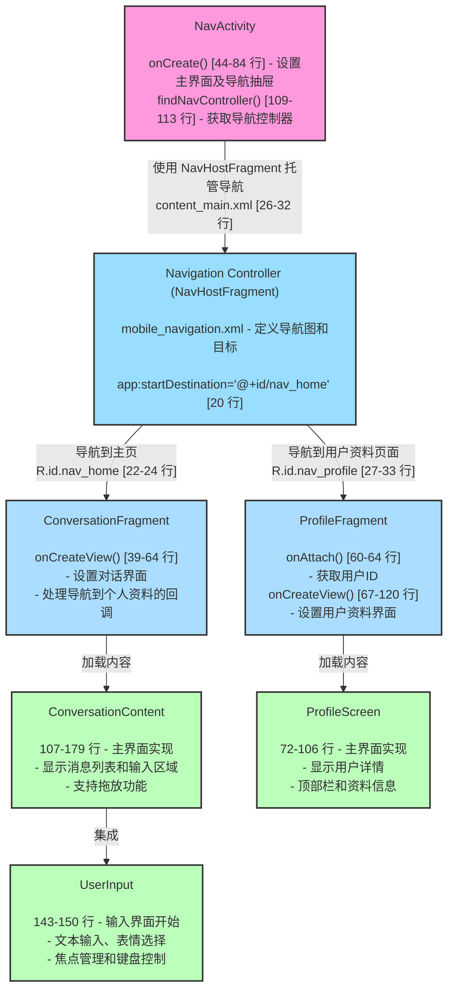

# 界面之间的层级和调用关系是怎样的？请绘制界面导航图并标注相关代码位置

根据对 Jetchat 应用代码的分析，我为您绘制了界面导航图并标注了相关的代码位置：

## Jetchat 界面导航关系图

上面的 Mermaid 图表完整呈现了 Jetchat 应用的界面层级和导航关系，包括：

1. 顶层 `NavActivity` 通过 `NavHostFragment` 管理导航
2. `Navigation Controller` 使用 `mobile_navigation.xml` 定义导航目标
3. 两个主要的 Fragment：`ConversationFragment` 和 `ProfileFragment`
4. 每个 Fragment 加载对应的 Compose 界面内容
5. `ConversationContent` 集成 `UserInput` 提供消息输入功能

图表中使用不同颜色区分了不同类型的组件，并标注了关键代码位置，让界面导航关系一目了然。

## 核心导航逻辑和调用关系

1. **顶层导航架构**:
   - `NavActivity` 是应用的主入口点，包含 `NavHostFragment`（在 `content_main.xml` 中定义）
   - `NavHostFragment` 加载 `mobile_navigation.xml` 中定义的导航图
   - 导航图定义了两个主要目的地：`nav_home`（ConversationFragment）和 `nav_profile`（ProfileFragment）

2. **导航抽屉逻辑**:
   - `NavActivity` 中通过 `JetchatDrawer` 组件（第 77-100 行）实现导航抽屉
   - 导航抽屉由 `JetchatScaffold.kt` 中的 `ModalNavigationDrawer` 提供（第 35-56 行）
   - 抽屉内容由 `JetchatDrawerContent` 实现（第 58-91 行），包含聊天和个人资料导航选项

3. **导航操作实现**:
   - 从聊天界面到个人资料：
     - `ConversationFragment` 中的 `navigateToProfile` 回调（第 50-57 行）
     - 通过 `findNavController().navigate(R.id.nav_profile, bundle)` 实现

   - 从导航抽屉到个人资料：
     - `NavActivity` 中的 `onProfileClicked` 回调（第 85-92 行）
     - 同样使用 `findNavController().navigate(R.id.nav_profile, bundle)` 实现

   - 打开导航抽屉：
     - 通过点击应用栏上的菜单图标触发 `MainViewModel.openDrawer()` 方法
     - `MainViewModel` 中的 `openDrawer()` 方法（第 32-34 行）更新状态流
     - 状态变化触发 `NavActivity` 中的 `LaunchedEffect`（第 63-73 行）打开抽屉

4. **小部件集成**:
   - `WidgetReceiver` 是应用小部件的入口点（第 21-27 行）
   - 接收小部件事件并通过 `JetChatWidget` 提供内容
   - 从小部件点击会启动 `NavActivity`

5. **Fragment 与 Compose 的交互**:
   - 传统 Fragment 架构与现代 Compose UI 混合使用
   - Fragment 通过 `ComposeView` 托管 Compose UI 组件
   - `ProfileFragment` 使用两个 `ComposeView`：一个用于应用栏，一个用于个人资料内容

以上就是 Jetchat 应用中界面层级和调用关系的完整导航图，包括关键代码位置的标注。
