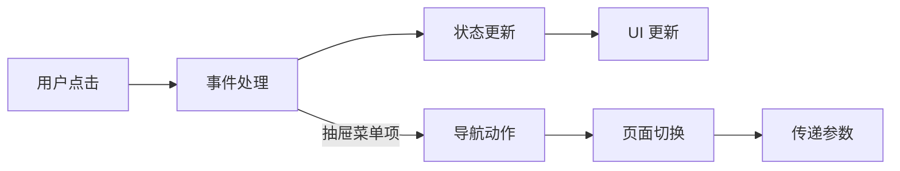
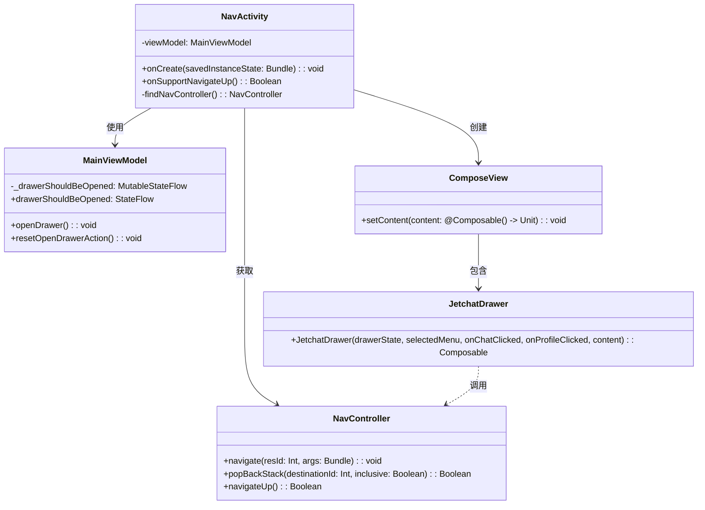
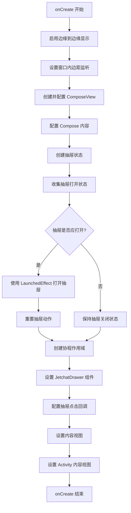
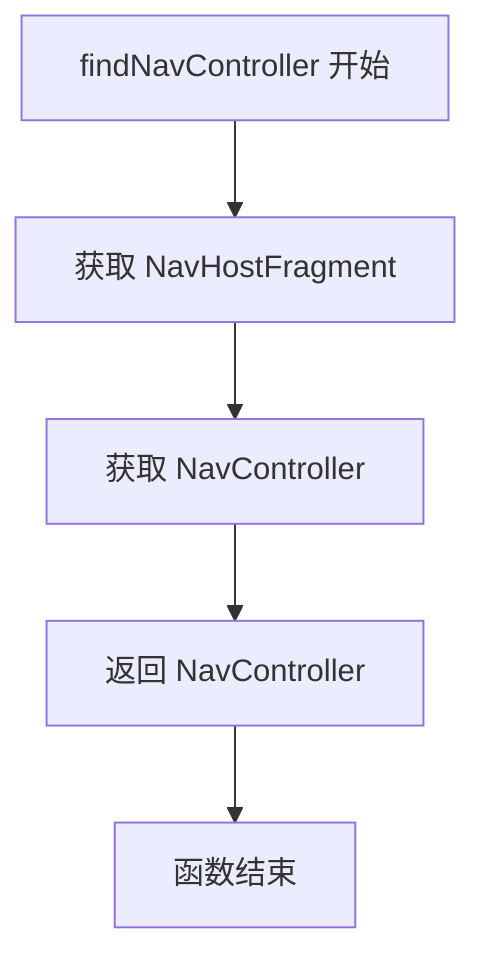

# NavActivity.kt 文件分析

## 1. 文件基本信息

- **文件名称**：NavActivity.kt
- **文件路径**：app/src/main/java/com/example/compose/jetchat/NavActivity.kt
- **主要功能**：作为 Jetchat 应用的主活动，负责管理导航抽屉、页面导航和内容展示
- **技术要点**：
  - Jetpack Compose 与传统 View 系统集成
  - Compose 状态管理
  - Navigation Component 导航
  - ViewModel 与 UI 状态管理
  - Material 3 抽屉界面
  - Kotlin 协程
  - 边缘到边缘显示

## 2. 分层架构分析

### 2.1 界面层（UI Layer）

#### 组件结构

```plaintext
NavActivity/                                   # 主活动容器
├── ComposeView/                               # Compose 根视图
│   └── JetchatDrawer/                         # 导航抽屉组件
│       ├── ModalDrawerSheet/                  # 抽屉内容容器
│       │   └── JetchatDrawerContent/          # 抽屉内容组件
│       └── AndroidViewBinding/                # XML 绑定视图
│           └── ContentMainBinding/            # 主内容 XML 布局
│               └── NavHostFragment/           # 导航宿主片段
```

#### 状态管理

- **抽屉状态**：使用 `rememberDrawerState(initialValue = Closed)` 在 Compose 中记忆抽屉状态
- **抽屉打开状态**：通过 ViewModel 的 `drawerShouldBeOpened` StateFlow 流，使用 `collectAsStateWithLifecycle()` 将其转换为 Compose 状态
- **选中菜单状态**：使用 `remember { mutableStateOf("composers") }` 记忆用户选择的菜单项
- **作用域状态**：使用 `rememberCoroutineScope()` 获取协程作用域，用于管理抽屉动画

#### Compose 特性

- **LaunchedEffect**：用于在抽屉打开状态变更时执行副作用操作
- **remember 和 mutableStateOf**：用于组件局部状态管理
- **rememberCoroutineScope**：提供结构化并发作用域
- **collectAsStateWithLifecycle**：生命周期感知的状态收集

#### 组件交互

- **导航交互**：
  - 点击抽屉菜单项时，通过 `NavController` 进行页面导航
  - 抽屉状态变更时，触发页面切换和参数传递
- **事件处理**：
  - 抽屉点击事件通过高阶函数回调处理
  - 页面导航后使用协程关闭抽屉
- **状态同步**：
  - 选中的菜单项与当前页面保持同步
  - 抽屉开关状态与 ViewModel 状态同步

### 2.2 业务层（Domain Layer）

#### 业务流程



#### ViewModel 分析

- **MainViewModel**：
  - 通过 `by viewModels()` 委托获取 ViewModel 实例
  - 管理 `drawerShouldBeOpened` 状态流
  - 提供 `openDrawer()` 和 `resetOpenDrawerAction()` 方法控制抽屉
  - 用作跨页面通信机制，各 Fragment 可通过 `activityViewModels()` 共享

#### 依赖注入

- 隐式依赖注入：
  - 通过 `by viewModels()` 委托自动获取 ViewModel 实例
  - 导航控制器通过 `findNavController()` 获取

### 2.3 数据层（Data Layer）

在该文件中，数据层相关代码较少，主要体现在：

- 通过 `bundleOf("userId" to it)` 在导航时传递用户 ID 数据
- 使用 ViewModel 维护抽屉状态

## 3. 代码质量分析

### 设计模式

- **MVVM 模式**：使用 ViewModel 管理 UI 状态
- **观察者模式**：通过 Flow 和状态收集实现响应式 UI
- **命令模式**：通过回调函数实现导航和抽屉操作

### Kotlin 特性

- **属性委托**：使用 `by viewModels()` 简化 ViewModel 获取
- **作用域函数**：使用 `apply {}` 简化 ComposeView 配置
- **高阶函数**：使用 lambda 表达式处理点击事件
- **协程**：使用 `launch {}` 处理异步抽屉操作
- **Flow API**：使用 StateFlow 管理响应式数据流

### 异步处理

- **协程**：使用 `rememberCoroutineScope` 和 `launch` 执行抽屉关闭动画
- **Flow**：使用 StateFlow 和 `collectAsStateWithLifecycle` 管理响应式状态
- **LaunchedEffect**：在合适的生命周期中执行副作用操作

### 性能考虑

- **边缘到边缘显示**：使用 `enableEdgeToEdge()` 优化全屏体验
- **生命周期感知**：使用 `collectAsStateWithLifecycle` 避免不必要的重组
- **异常处理**：使用 `try-finally` 确保即使在中断时也能重置状态
- **窗口内边距控制**：设置 `consumeWindowInsets = false` 优化布局

## 4. UML 类图



## 5. 业务函数流程图

### onCreate 函数流程



### findNavController 函数流程



## 6. API 使用分析

### 重要 API

| API 名称 | 用途 | 文档链接 |
|---------|------|---------|
| enableEdgeToEdge | 启用边缘到边缘显示，提供沉浸式体验 | [链接](https://developer.android.com/reference/androidx/activity/ComponentActivity#enableEdgeToEdge()) |
| viewModels | Activity 范围内获取 ViewModel 实例 | [链接](https://developer.android.com/reference/kotlin/androidx/activity/viewmodels/package-summary) |
| ComposeView | 在传统 View 系统中集成 Compose UI | [链接](https://developer.android.com/reference/kotlin/androidx/compose/ui/platform/ComposeView) |
| rememberDrawerState | 创建和记忆抽屉组件状态 | [链接](https://developer.android.com/reference/kotlin/androidx/compose/material3/package-summary#rememberDrawerState(androidx.compose.material3.DrawerValue)) |
| collectAsStateWithLifecycle | 将 Flow 转换为生命周期感知的 Compose 状态 | [链接](https://developer.android.com/reference/kotlin/androidx/lifecycle/compose/package-summary#collectAsStateWithLifecycle(kotlinx.coroutines.flow.Flow)) |
| AndroidViewBinding | 在 Compose 中集成 View 绑定布局 | [链接](https://developer.android.com/reference/kotlin/androidx/compose/ui/viewinterop/package-summary#AndroidViewBinding(kotlin.Function1)) |
| NavController | 处理应用内导航的控制器 | [链接](https://developer.android.com/reference/androidx/navigation/NavController) |

### 第三方库

文件中未直接使用第三方库，主要使用了 Android Jetpack 组件：

- **Jetpack Compose**：声明式 UI 框架
- **Navigation Component**：页面导航框架
- **ViewModel**：UI 状态管理
- **ViewBinding**：XML 布局绑定
- **Kotlin Coroutines**：异步操作支持

## 7. Compose 特定分析

### Composable 函数

虽然该文件未直接定义 Composable 函数，但调用了以下关键 Composable：

- **JetchatDrawer**：提供抽屉导航界面的组件
  - 参数：
    - `drawerState`：抽屉状态
    - `selectedMenu`：当前选中的菜单项
    - `onChatClicked`：聊天项点击回调
    - `onProfileClicked`：个人资料点击回调
    - `content`：抽屉内容槽位

### 重组优化

- **remember**：记住选中菜单状态，避免重组时丢失
- **rememberDrawerState**：记住抽屉状态，保持动画连续性
- **rememberCoroutineScope**：记住协程作用域，避免重组时创建新实例
- **collectAsStateWithLifecycle**：生命周期感知的状态收集，减少无用重组

### 副作用处理

- **LaunchedEffect**：在组合进入时触发抽屉打开副作用
- **try-finally**：确保即使在异常情况下也能重置抽屉状态
- **Coroutine launch**：异步处理抽屉关闭动画

## 8. 注意事项与最佳实践

### 优点

- **组合架构**：成功结合 Compose 与传统 View 系统
- **状态管理**：清晰的状态管理和事件处理流程
- **结构化并发**：使用 CoroutineScope 管理异步操作
- **错误处理**：使用 try-finally 确保状态正确重置
- **边缘到边缘优化**：提供全屏沉浸式体验

### 改进空间

- **状态提升**：可考虑将 `selectedMenu` 状态提升到 ViewModel 管理
- **组件化**：可将主内容部分提取为独立的 Composable 函数
- **参数类型安全**：导航参数传递可使用类型安全的方式（如 Safe Args 插件）
- **依赖注入框架**：可考虑使用 Hilt 或 Koin 进行更明确的依赖注入

### 风险点

- **实验性 API**：使用 `@OptIn(ExperimentalMaterial3Api::class)` 标记的实验性 Material 3 API
- **Fragment 导航**：`findNavController()` 方法存在已知问题（见代码注释引用的问题链接）
- **硬编码值**：菜单默认值 "composers" 硬编码在代码中
- **跨组件通信**：使用 ViewModel 进行跨页面通信可能导致紧耦合 