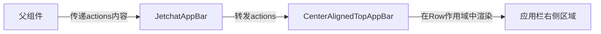

# Jetpack Compose 代码块分析：JetchatAppBar actions 参数实现

## 1. 业务逻辑分析

### 功能与作用

这行代码定义了 JetchatAppBar 组件的 `actions` 参数，它允许开发者在应用栏右侧区域添加自定义操作按钮。从业务角度看：

- 作为 TopAppBar 右侧操作区域的内容提供者
- 允许父组件灵活定制右侧的功能按钮（如搜索、设置、更多选项等）
- 默认为空实现，表示不显示任何操作按钮
- 直接传递给 Material 3 的 CenterAlignedTopAppBar 组件

### 数据流动过程



### 设计模式与架构思想

该参数采用了以下设计模式：

- **组合模式**：通过可组合函数接收子内容进行组合
- **依赖注入**：操作区域内容由外部注入，而非内部创建
- **槽位模式**（Slot Pattern）：为特定UI区域提供"槽位"，由调用者填充内容

## 2. Kotlin 语法特性

这行代码展示了多个 Kotlin 高级语法特性：

### 高阶函数与函数类型

`@Composable RowScope.() -> Unit` 是一个高阶函数类型，具体包含：

- 函数类型表示法：`() -> Unit`（无参数，无返回值）
- 接收者类型（带接收者的函数类型）：`RowScope.()`

### 带接收者的函数类型

`RowScope.() -> Unit` 表示这个函数在 `RowScope` 接收者上下文中执行，这意味着：

- 函数内部可以直接访问 `RowScope` 的所有成员和扩展
- 函数体内的 `this` 指向 `RowScope` 实例
- 可以访问 Row 作用域内的布局修饰符和辅助函数

### 默认参数值

`= {}` 提供了一个空的 lambda 表达式作为默认值，这表示：

- 如果调用者未提供此参数，则使用空实现（不渲染任何操作按钮）
- 简化了 API 的使用，使参数成为可选的

## 3. Compose 技术解析

### Composable 函数类型

`@Composable` 注解表明这个参数是一个可组合函数类型，意味着：

- 可以在此函数内使用其他 Composable 函数
- 函数受 Compose 运行时管理，参与重组机制
- 可以使用 Compose 的状态管理和生命周期工具

### 作用域限定

`RowScope` 作为接收者类型，为函数体提供了行布局特定的作用域，提供：

- 水平布局相关的修饰符（如 `weight`、`align` 等）
- 确保操作按钮在水平方向正确排列
- 访问 Row 作用域内特定的布局函数

### 内容槽位模式

这是 Compose 中常见的"内容槽位"模式的实现：

- 为特定 UI 区域提供可自定义的内容
- 允许组件在保持整体结构的同时，局部区域灵活定制
- 提高了组件的复用性和灵活性

## 4. 最佳实践与改进建议

### 符合最佳实践之处

- **职责单一**：参数专注于提供操作区域内容，符合单一职责原则
- **默认实现**：提供默认空实现，减少使用者的负担
- **类型安全**：使用 `RowScope` 限定作用域，避免错误使用
- **与 Material 组件对齐**：直接映射到 Material 3 组件的同名参数

### 可能的改进

- **添加参数文档**：为参数添加更详细的 KDoc 注释，说明用途和示例
- **考虑添加辅助构造函数**：为常见的操作按钮组合提供便捷构造函数

## 5. 补充说明

### 实际应用案例

在实际应用中，actions 参数可用于添加如下元素：

- 搜索按钮
- 设置/更多选项菜单
- 通知徽章
- 用户头像或个人资料入口

### 官方参考资料

- [Compose Material 3 TopAppBar 文档](https://developer.android.com/reference/kotlin/androidx/compose/material3/package-summary#CenterAlignedTopAppBar)
- [Jetpack Compose 槽位 API 设计](https://developer.android.com/jetpack/compose/layouts/basics#slot-based-layouts)

### 使用示例

```kotlin
JetchatAppBar(
    title = { Text("聊天室") },
    actions = {
        IconButton(onClick = { /* 搜索操作 */ }) {
            Icon(Icons.Default.Search, contentDescription = "搜索")
        }
        IconButton(onClick = { /* 更多选项 */ }) {
            Icon(Icons.Default.MoreVert, contentDescription = "更多选项")
        }
    }
)
```
