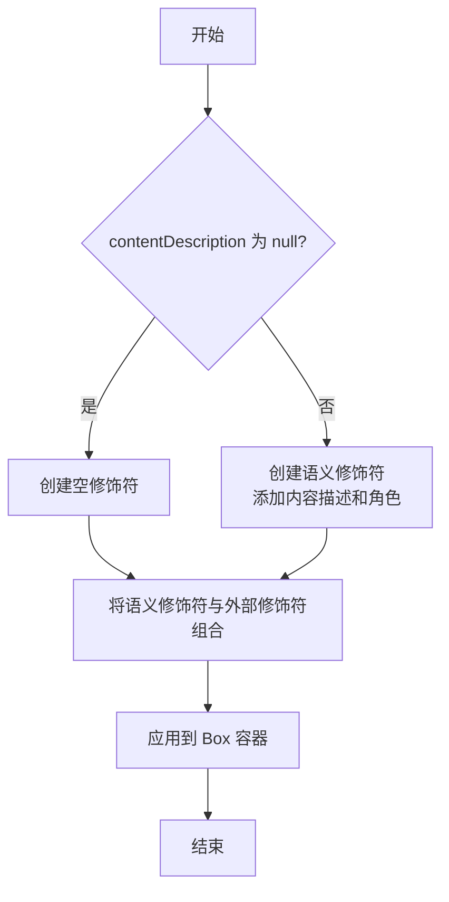

# 代码块分析报告：语义化修饰符实现

## 1. 业务逻辑分析

### 详细解释

代码块 L36-44 实现了 JetchatIcon 组件中的无障碍访问功能（Accessibility），采用条件语句创建一个语义修饰符（Semantics Modifier），然后将其应用到组件的根容器上。

```kotlin
val semantics = if (contentDescription != null) {
    Modifier.semantics {
        this.contentDescription = contentDescription
        this.role = Role.Image
    }
} else {
    Modifier
}
Box(modifier = modifier.then(semantics)) {
```

### 业务流程与功能实现

该代码块的主要流程是：

1. 检查 `contentDescription` 参数是否为 null
2. 若不为 null，创建一个包含内容描述和角色信息的语义修饰符
3. 若为 null，使用空修饰符（不添加额外语义信息）
4. 将创建的语义修饰符与外部传入的修饰符组合，并应用到 Box 容器上



### 设计思想

此代码遵循以下设计思想：

1. **关注点分离**：将无障碍功能与视觉渲染分开处理
2. **条件渲染**：只在必要时添加语义信息，避免冗余
3. **组合模式**：通过修饰符组合实现功能扩展
4. **无障碍优先**：确保组件在辅助功能方面的可用性

## 2. Kotlin 语法特性

### Lambda 表达式

```kotlin
Modifier.semantics {
    this.contentDescription = contentDescription
    this.role = Role.Image
}
```

这里使用了 Kotlin 的 Lambda 表达式作为 `semantics` 函数的参数。Lambda 体内的 `this` 指向 `SemanticsPropertyReceiver` 实例，允许我们在语义属性接收器的上下文中设置属性。

### 作用域函数

`semantics` 是一个作用域函数，它创建一个特定上下文（语义属性接收器），在此上下文中可以配置语义属性。这是 Kotlin 领域特定语言（DSL）的典型用法。

### 安全调用与条件表达式

代码使用了 if-else 条件表达式作为表达式返回值，这是 Kotlin 中表达式优先的特性体现。

### 函数链式调用

```kotlin
Box(modifier = modifier.then(semantics)) {
```

`then()` 函数是 Compose 修饰符的扩展函数，用于组合多个修饰符。这展示了 Kotlin 的链式调用能力，使代码更简洁易读。

## 3. Compose 技术解析

### 语义化修饰符（Semantics Modifier）

`semantics` 修饰符是 Compose 中处理无障碍功能的关键工具。它允许开发者为 UI 元素添加额外的语义信息，辅助设备（如屏幕阅读器）可以使用这些信息来描述和交互界面元素。

### 修饰符组合

`modifier.then(semantics)` 展示了 Compose 修饰符的组合机制。此处使用 `then()` 函数将外部传入的修饰符与新创建的语义修饰符组合在一起，体现了 Compose 修饰符的可组合性原则。

### 内容描述与角色

- `contentDescription`：为视觉元素提供文本描述，供屏幕阅读器使用
- `role = Role.Image`：指定元素的语义角色为图像，这帮助辅助技术理解元素的用途

### UI 构建策略

代码使用 `Box` 作为容器，这是 Compose 中最基本的布局容器之一，允许其子元素重叠放置。通过语义修饰符增强 `Box`，而非直接增强每个图标，遵循了"单一职责"原则。

## 4. 最佳实践与改进建议

### 符合最佳实践之处

1. **语义分离**：将语义信息与视觉渲染分离，遵循关注点分离原则
2. **条件添加**：仅在提供 `contentDescription` 时才添加语义，避免不必要的开销
3. **统一语义点**：在容器上而非每个图标上设置语义，防止重复朗读或冲突
4. **适当角色指定**：明确指定元素角色为 `Role.Image`，有助于辅助功能正确解释元素

### 改进建议

1. **提取语义构建函数**：如果项目中多处使用类似模式，可考虑提取一个公共函数：

   ```kotlin
   fun buildSemantics(contentDescription: String?): Modifier {
       return if (contentDescription != null) {
           Modifier.semantics {
               this.contentDescription = contentDescription
               this.role = Role.Image
           }
       } else {
           Modifier
       }
   }
   ```

2. **使用 mergeSemantics**：如果在复杂组件中需要合并多个语义源，可以使用 `Modifier.semantics(mergeDescendants = true)` 确保语义正确合并

3. **添加测试代码**：针对无障碍功能添加专门的测试，确保语义信息正确传递

## 5. 补充说明

### 相关文档

- [Compose 无障碍文档](https://developer.android.com/jetpack/compose/accessibility)
- [语义属性参考](https://developer.android.com/reference/kotlin/androidx/compose/ui/semantics/package-summary)
- [Role 枚举文档](https://developer.android.com/reference/kotlin/androidx/compose/ui/semantics/Role)

### 易混淆部分

- `contentDescription` 参数与语义属性中的 `contentDescription` 同名，但作用不同：前者是函数参数，后者是语义属性
- `modifier.then(semantics)` 中 `then` 函数的作用是按顺序组合修饰符，顺序很重要，可能影响某些修饰符的行为

### 实际应用场景

此代码展示的模式适用于：

1. 创建由多个视觉元素组成但在语义上是单一实体的自定义组件
2. 实现具有特定无障碍需求的徽标、图标或装饰元素
3. 需要为组合视觉元素提供统一描述的场景
4. 添加辅助功能支持，同时保持视觉设计完整性

通过这种方式，JetchatIcon 组件既能满足视觉设计要求（两个重叠的图标），又能提供良好的无障碍体验（单一的内容描述）。
