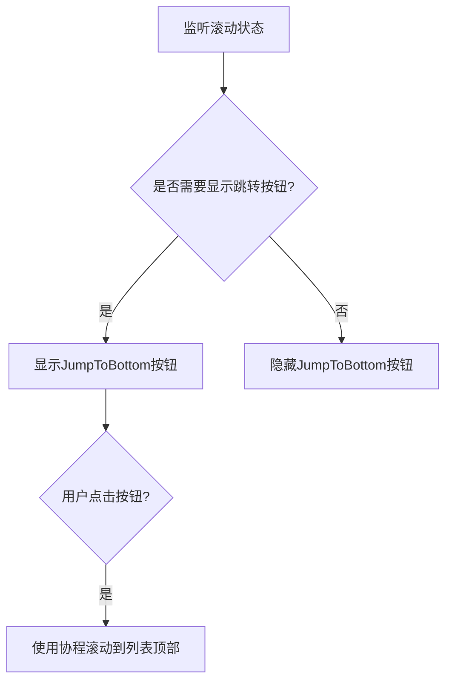

# Jetpack Compose 代码块分析：L329-342

## 代码块

```kotlin
// Jump to bottom button shows up when user scrolls past a threshold.
// Convert to pixels:
val jumpThreshold = with(LocalDensity.current) {
    JumpToBottomThreshold.toPx()
}

// Show the button if the first visible item is not the first one or if the offset is
// greater than the threshold.
val jumpToBottomButtonEnabled by remember {
    derivedStateOf {
        scrollState.firstVisibleItemIndex != 0 ||
            scrollState.firstVisibleItemScrollOffset > jumpThreshold
    }
}
```

## 业务逻辑分析

这段代码实现了一个聊天应用中的"返回顶部"功能，属于消息列表界面的辅助导航功能。具体而言，它通过检测用户的滚动位置动态决定是否显示"返回顶部"按钮，并在用户点击该按钮时自动滚动到消息列表顶部。



整个流程体现了Jetpack Compose响应式UI的思想：

1. 通过`derivedStateOf`观察滚动状态
2. 根据状态决定UI展示
3. 响应用户操作执行相应动作

## Kotlin语法特性

这段代码展示了多个Kotlin高级语法特性：

1. **属性委托**：使用`by`关键字实现属性委托，`jumpToBottomButtonEnabled by remember { ... }`将计算结果委托给`remember`和`derivedStateOf`处理

2. **Lambda表达式**：代码中多处使用Lambda表达式简化代码，如：

   ```kotlin
   derivedStateOf {
       scrollState.firstVisibleItemIndex != 0 ||
           scrollState.firstVisibleItemScrollOffset > jumpThreshold
   }
   ```

3. **作用域函数**：使用`with(LocalDensity.current) { ... }`创建上下文作用域，简化对`LocalDensity`的访问

4. **协程**：通过`scope.launch { ... }`启动协程执行动画滚动操作，实现非阻塞式的UI动画

## Compose技术解析

1. **状态管理**：
   - `remember`函数用于在组件重组时保留状态
   - `derivedStateOf`创建派生状态，只有依赖值发生变化时才会重新计算，减少不必要的重组

2. **布局处理**：
   - `Modifier.align(Alignment.BottomCenter)`将按钮定位在父容器底部中央
   - 智能应用组件的可见性，而不是从DOM中完全移除它

3. **性能优化**：
   - 使用`derivedStateOf`避免不必要的重新计算
   - 通过界面值阈值(`JumpToBottomThreshold`)避免UI闪烁

4. **状态提升**：
   - `scrollState`是从上层传入的状态，展示了Compose中状态提升的概念
   - 按钮启用状态从滚动状态派生，体现了单向数据流

## 最佳实践与改进建议

### 符合最佳实践的部分

1. 使用`derivedStateOf`优化性能，避免每次重组都重新计算条件
2. 遵循单一职责原则，这段代码只负责跳转按钮的逻辑
3. 代码中包含清晰的注释，解释逻辑和阈值的用途

### 可能的改进

1. 按钮的阈值(`JumpToBottomThreshold`)定义在文件末尾，可以考虑将其移至更明显的位置或作为参数传入
2. 可以添加动画效果使按钮的显示和隐藏更平滑，例如使用`AnimatedVisibility`
3. 考虑提取此功能为一个独立的可复用组件，便于在其他列表场景中使用

## 补充说明

这个功能在长列表UX中非常常见，特别是在聊天应用中。当用户滚动查看历史消息后，提供一个快速返回最新消息（列表顶部）的方式可以显著提升用户体验。

代码中的`JumpToBottomThreshold`设置为56dp，这是一个经验值，大约相当于一个标准Material Design按钮的高度，作为滚动判断的阈值。

值得注意的是，Compose中的`LazyColumn`使用了反向布局（`reverseLayout = true`），因此列表的"底部"实际上是最新消息所在的位置，即视觉上的"顶部"，这是聊天应用的常见实现方式。

相关资源：

- [Jetpack Compose中的状态管理](https://developer.android.com/jetpack/compose/state)
- [使用derivedStateOf的最佳实践](https://developer.android.com/jetpack/compose/side-effects#derivedstateof)
