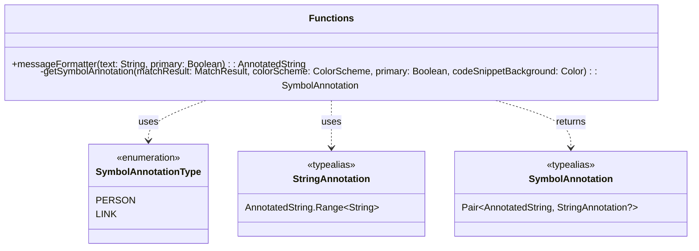
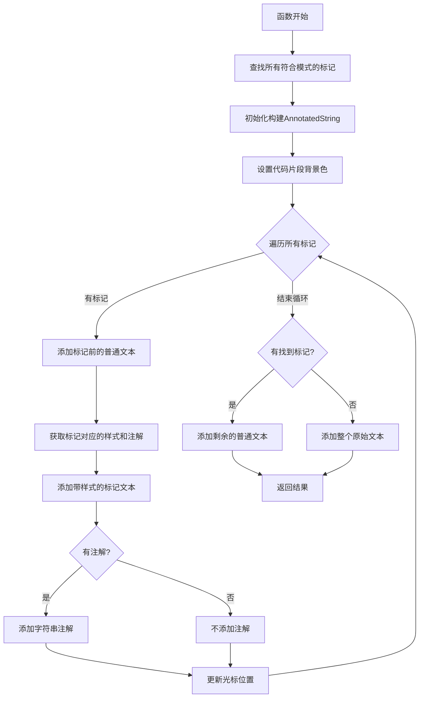

# MessageFormatter.kt 文件分析

## 文件基本信息

- **文件名称**：MessageFormatter.kt
- **文件路径**：app/src/main/java/com/example/compose/jetchat/conversation/MessageFormatter.kt
- **主要功能**：实现类似 Markdown 语法的消息格式化，将纯文本消息转换为带有样式和交互能力的富文本（AnnotatedString）
- **技术要点**：
  - Compose 文本处理
  - 正则表达式解析
  - AnnotatedString 构建
  - 文本样式定制
  - 可点击文本注解

## 分层架构分析

此文件主要属于界面层（UI Layer），负责文本格式化与渲染的处理逻辑。

### 界面层（UI Layer）

#### 组件结构

```plaintext
messageFormatter/                           # 消息格式化主函数，@Composable
└── getSymbolAnnotation/                    # 符号注解处理辅助函数
```

#### Compose 特性

- **@Composable 注解**：使用了 `@Composable` 注解标记 `messageFormatter` 函数
- **MaterialTheme 使用**：利用 MaterialTheme 获取当前主题的颜色方案
- **无状态设计**：函数设计为纯转换功能，不持有状态

#### 组件交互

- 该组件作为纯函数提供服务，不直接与其他组件通信
- 通过返回带注解的 AnnotatedString，为上层组件提供可交互文本的支持

## 代码质量分析

### 设计模式

- **策略模式**：通过 `getSymbolAnnotation` 函数处理不同类型标记的策略选择
- **构建器模式**：使用 `buildAnnotatedString` 构建复杂的文本对象

### Kotlin 特性

- **懒加载属性**：使用 `by lazy` 延迟初始化正则表达式对象
- **类型别名**：使用 `typealias` 简化复杂类型定义
- **枚举类**：使用 `enum class` 定义注解类型
- **范围表达式**：使用 `..` 操作符表示范围
- **空条件判断**：使用 `if (x != null)` 条件判断

### 性能考虑

- **正则表达式优化**：通过懒加载方式只编译一次正则表达式
- **文本处理优化**：逐步处理文本片段，避免重复解析
- **内存效率**：不创建不必要的中间字符串，直接操作索引和范围

## UML 类图



## 业务函数流程图

### messageFormatter 函数流程



### getSymbolAnnotation 函数流程

```mermaid
flowchart TD
    A[函数开始] --> B{根据首字符分类}
    B -->|@| C[创建人物注解]
    B -->|*| D[创建粗体注解]
    B -->|_| E[创建斜体注解]
    B -->|~| F[创建删除线注解]
    B -->|`| G[创建代码片段注解]
    B -->|h| H[创建链接注解]
    B -->|其他| I[创建普通文本注解]
    C --> J[返回注解对]
    D --> J
    E --> J
    F --> J
    G --> J
    H --> J
    I --> J
```

## API 使用分析

### 重要 API

| API 名称 | 用途 | 文档链接 |
|---|---|---|
| buildAnnotatedString | 构建富文本字符串 | [链接](https://developer.android.com/jetpack/compose/text) |
| addStringAnnotation | 添加可点击文本注解 | [链接](https://developer.android.com/jetpack/compose/text) |
| SpanStyle | 定制文本片段样式 | [链接](https://developer.android.com/jetpack/compose/text) |
| MaterialTheme | 获取应用主题样式 | [链接](https://developer.android.com/jetpack/compose/themes) |

### 第三方库

文件仅使用 Jetpack Compose 官方库，未引入其他第三方库。

## Compose 特定分析

### Composable 函数

- **messageFormatter**
  - 参数：
    - text: String - 要格式化的纯文本消息
    - primary: Boolean - 是否使用主要颜色方案
  - 返回值：AnnotatedString - 带有样式和注解的富文本

### 主题与样式

- 根据 primary 参数选择不同的颜色方案
- 使用 MaterialTheme.colorScheme 获取当前主题颜色
- 为不同类型的标记（链接、用户名、代码等）应用不同样式

## 注意事项与最佳实践

### 优点

- 良好的关注点分离，将文本格式化逻辑从渲染逻辑中分离
- 优雅的正则表达式处理，一次匹配多种格式标记
- 清晰的注释说明各种支持的语法
- 使用类型别名提高代码可读性
- 使用枚举类型增强类型安全

### 改进空间

- 可考虑使用更高级的状态管理，如将格式化结果缓存
- 对于复杂的正则表达式匹配，可考虑添加更多的单元测试
- 可以考虑将功能扩展为支持更多的Markdown语法

### 风险点

- 复杂的正则表达式可能在某些特殊输入下性能不佳
- 内联代码中的硬编码样式值（如 `BaselineShift(0.2f)`）缺乏解释说明
- 没有处理嵌套格式化的情况（如 **斜体粗体**）
