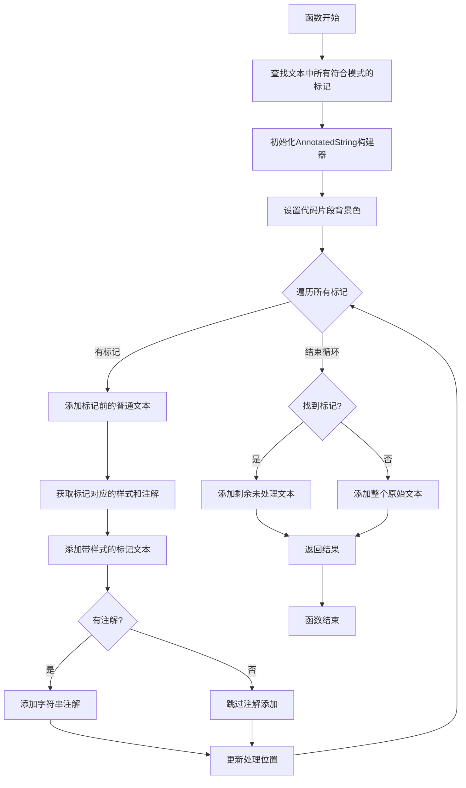
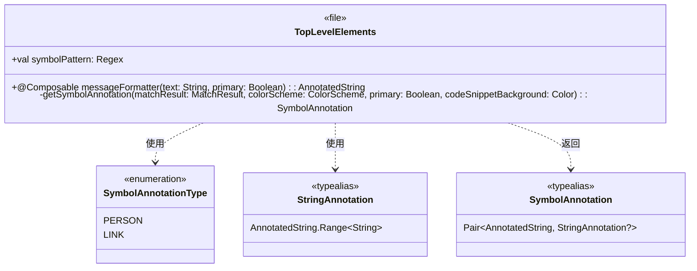

# MessageFormatter.kt 文件分析

## 文件基本信息

- **文件名称**：MessageFormatter.kt
- **文件路径**：app/src/main/java/com/example/compose/jetchat/conversation/MessageFormatter.kt
- **主要功能**：实现类似 Markdown 语法的消息格式化，将纯文本消息转换为带有样式和交互能力的富文本（AnnotatedString）
- **技术要点**：
  - Compose 文本处理与富文本构建
  - 正则表达式解析与匹配
  - AnnotatedString 和文本注解
  - SpanStyle 文本样式定制
  - 可点击文本元素实现

## 语法元素分析

### 语法元素概览

#### 包声明

```kotlin
package com.example.compose.jetchat.conversation
```

包结构遵循 Android 项目标准命名规范，按功能模块分层：

- `com.example.compose.jetchat`：应用基础包
- `.conversation`：对话功能子模块

#### 导入声明

导入可分为以下几类：

**1. Compose UI 基础组件**

```kotlin
import androidx.compose.material3.ColorScheme
import androidx.compose.material3.MaterialTheme
import androidx.compose.runtime.Composable
import androidx.compose.ui.graphics.Color
```

**2. 文本处理相关**

```kotlin
import androidx.compose.ui.text.AnnotatedString
import androidx.compose.ui.text.SpanStyle
import androidx.compose.ui.text.buildAnnotatedString
import androidx.compose.ui.text.font.FontFamily
import androidx.compose.ui.text.font.FontStyle
import androidx.compose.ui.text.font.FontWeight
import androidx.compose.ui.text.style.BaselineShift
import androidx.compose.ui.text.style.TextDecoration
import androidx.compose.ui.unit.sp
```

#### 元素统计

| 元素类型 | 数量 | 备注 |
|---|---|---|
| 类      | 0    | 无普通类定义 |
| 接口    | 0    | 无接口定义 |
| 对象    | 0    | 无对象定义 |
| 函数    | 2    | 1个 Composable 函数, 1个私有辅助函数 |
| 扩展函数 | 0    | 无扩展函数 |
| 属性    | 1    | 顶层属性(正则表达式) |
| 枚举类  | 1    | 注解类型枚举 |
| 类型别名 | 2    | 简化复杂类型定义 |

### 全局变量与常量分析

#### symbolPattern

- **变量/常量名**：symbolPattern
- **类型**：Regex
- **作用域**：顶层变量，包内可见
- **用途**：定义用于匹配消息中特殊语法标记的正则表达式
- **初始化**：使用 `by lazy` 延迟初始化，避免不必要的正则表达式编译开销
- **使用方式**：在 messageFormatter 函数中用于查找消息文本中的标记
- **正则表达式分析**：

  ```
  (https?://[^\s\t\n]+)|(`[^`]+`)|(@\w+)|(\*[\w]+\*)|(_[\w]+_)|(~[\w]+~)
  ```

  匹配六种不同的格式：
  1. `https?://[^\s\t\n]+` - 超链接
  2. `` `[^`]+` `` - 代码段
  3. `@\w+` - 用户名标记
  4. `\*[\w]+\*` - 粗体文本
  5. `_[\w]+_` - 斜体文本
  6. `~[\w]+~` - 删除线文本

### 枚举类分析

#### SymbolAnnotationType

- **类/接口名称**：SymbolAnnotationType
- **类型**：枚举类
- **职责描述**：定义可点击文本的注解类型
- **枚举值分析**：
  - `PERSON`：表示用户名标记（@用户名）
  - `LINK`：表示超链接（http(s)://...）

### 类型别名分析

#### StringAnnotation

- **类型别名**：StringAnnotation
- **实际类型**：AnnotatedString.Range<String>
- **用途**：简化对文本注解范围类型的引用

#### SymbolAnnotation

- **类型别名**：SymbolAnnotation
- **实际类型**：Pair<AnnotatedString, StringAnnotation?>
- **用途**：表示带有可选注解的已格式化文本段，用于返回结果

### 函数分析

#### messageFormatter

- **函数名称**：messageFormatter
- **函数签名**：`@Composable fun messageFormatter(text: String, primary: Boolean): AnnotatedString`
- **函数职责**：解析文本消息中的特殊语法标记，并将其转换为带有样式和交互功能的富文本
- **参数分析**：
  - `text: String`：要格式化的原始文本消息
  - `primary: Boolean`：是否使用主要颜色方案，影响文本颜色和背景色样式
- **返回值分析**：`AnnotatedString` - 带有样式和注解的富文本，可用于 Compose 的 Text 组件
- **函数流程图**：



- **调用关系**：
  - 调用 `symbolPattern.findAll(text)` 获取所有匹配
  - 调用 `buildAnnotatedString {}` 构建富文本
  - 调用 `getSymbolAnnotation()` 处理各类标记
  - 调用 `addStringAnnotation()` 添加可点击注解
- **边界条件**：
  - 空文本：会直接返回空的 AnnotatedString
  - 无匹配：会直接返回无样式的原始文本
  - 嵌套标记：当前实现不支持嵌套格式化（如粗体内的斜体）
- **复杂度分析**：
  - 时间复杂度：O(n)，其中 n 是文本长度（每个字符最多处理一次）
  - 空间复杂度：O(n)，需要存储原始文本和构建的 AnnotatedString

#### getSymbolAnnotation

- **函数名称**：getSymbolAnnotation
- **函数签名**：`private fun getSymbolAnnotation(matchResult: MatchResult, colorScheme: ColorScheme, primary: Boolean, codeSnippetBackground: Color): SymbolAnnotation`
- **函数职责**：根据匹配的标记类型，生成相应的样式文本和可能的注解
- **参数分析**：
  - `matchResult: MatchResult`：正则表达式匹配结果
  - `colorScheme: ColorScheme`：当前主题的颜色方案
  - `primary: Boolean`：是否使用主要颜色
  - `codeSnippetBackground: Color`：代码段背景色
- **返回值分析**：`SymbolAnnotation` (Pair<AnnotatedString, StringAnnotation?>)
  - 第一部分：带样式的文本
  - 第二部分：可选的文本注解（用于点击事件）
- **函数流程图**：

```mermaid
flowchart TD
    A[函数开始] --> B{根据标记首字符判断类型}
    B -->|@| C[创建用户名标记: 粗体+主色]
    B -->|*| D[创建粗体文本]
    B -->|_| E[创建斜体文本]
    B -->|~| F[创建删除线文本]
    B -->|`| G[创建代码片段: 等宽字体+背景色]
    B -->|h| H[创建超链接: 主色]
    B -->|其他| I[保持原文本]
    C --> J[添加PERSON注解]
    D --> K[无注解]
    E --> K
    F --> K
    G --> K
    H --> L[添加LINK注解]
    I --> K
    J --> M[返回结果对]
    K --> M
    L --> M
    M --> N[函数结束]
```

- **调用关系**：被 messageFormatter 函数调用
- **边界条件**：
  - 处理了所有定义的标记类型
  - 对于未定义的标记类型，返回原始文本无样式无注解
- **复杂度分析**：
  - 时间复杂度：O(1)，简单的条件判断和对象创建
  - 空间复杂度：O(1)，创建一个固定大小的对象

### Composable 函数分析

#### messageFormatter 函数

- **参数与状态**：
  - 无内部状态，是一个纯函数式实现
  - 参数 `text` 提供输入文本
  - 参数 `primary` 控制颜色方案选择
- **重组行为**：
  - 遵循纯函数原则，相同输入产生相同输出
  - 无副作用，适合 Compose 的记忆化优化
  - 无内部状态，不会触发不必要的重组
- **UI 结构图**：该函数不直接生成 UI，而是提供用于 Text 组件的格式化文本

## Kotlin 语法特性分析

### 1. 属性委托

- **懒加载**：`by lazy` 用于延迟初始化 symbolPattern 正则表达式，避免不必要的编译开销

  ```kotlin
  val symbolPattern by lazy {
      Regex("""(https?://[^\s\t\n]+)|(`[^`]+`)|(@\w+)|(\*[\w]+\*)|(_[\w]+_)|(~[\w]+~)""")
  }
  ```

### 2. 类型别名

- **typealias** 用于简化复杂类型表达式，提高代码可读性：

  ```kotlin
  typealias StringAnnotation = AnnotatedString.Range<String>
  typealias SymbolAnnotation = Pair<AnnotatedString, StringAnnotation?>
  ```

### 3. 枚举类

- 使用 **enum class** 定义有限集合的值：

  ```kotlin
  enum class SymbolAnnotationType {
      PERSON, LINK
  }
  ```

### 4. 作用域函数与 DSL

- **buildAnnotatedString {}** 使用 Kotlin DSL 构建复杂对象：

  ```kotlin
  return buildAnnotatedString {
      // 在 DSL 上下文中添加文本和样式
  }
  ```

### 5. 解构声明

- 使用解构声明简化 Pair 处理：

  ```kotlin
  val (annotatedString, stringAnnotation) = getSymbolAnnotation(...)
  val (item, start, end, tag) = stringAnnotation
  ```

### 6. 范围表达式

- 使用 `..` 操作符表示索引范围：

  ```kotlin
  text.slice(cursorPosition..text.lastIndex)
  ```

### 7. 条件判断与流程控制

- 使用 **when** 表达式根据条件返回不同值：

  ```kotlin
  return when (matchResult.value.first()) {
      '@' -> // ...
      '*' -> // ...
      // ...
      else -> // ...
  }
  ```

## API 使用分析

### 重要 API

| API 名称 | 用途 | 文档链接 |
|---|---|---|
| Compose Text API | 富文本处理和渲染 | [链接](https://developer.android.com/jetpack/compose/text) |
| AnnotatedString | 创建带样式和注解的文本 | [链接](https://developer.android.com/reference/kotlin/androidx/compose/ui/text/AnnotatedString) |
| buildAnnotatedString | 使用 DSL 构建富文本 | [链接](https://developer.android.com/reference/kotlin/androidx/compose/ui/text/package-summary#buildAnnotatedString(kotlin.Function1)) |
| SpanStyle | 应用文本片段样式 | [链接](https://developer.android.com/reference/kotlin/androidx/compose/ui/text/SpanStyle) |
| addStringAnnotation | 添加可点击文本注解 | [链接](https://developer.android.com/reference/kotlin/androidx/compose/ui/text/AnnotatedString.Builder#addStringAnnotation(kotlin.String,kotlin.String,kotlin.Int,kotlin.Int)) |
| Regex | 正则表达式处理 | [链接](https://kotlinlang.org/api/latest/jvm/stdlib/kotlin.text/-regex/) |
| MaterialTheme | 获取当前主题设置 | [链接](https://developer.android.com/reference/kotlin/androidx/compose/material3/MaterialTheme) |

### 第三方库

文件主要使用 Jetpack Compose 官方库，无第三方依赖：

1. **androidx.compose.material3**：Material Design 3 组件和主题
2. **androidx.compose.ui.text**：Compose 文本处理工具
3. **androidx.compose.runtime**：Compose 运行时和注解

## UML 类图



## 注意事项与最佳实践

### 优点

1. **关注点分离**：将文本格式化逻辑从 UI 渲染中分离，便于维护
2. **函数式设计**：使用纯函数实现，无副作用，易于测试和重用
3. **延迟初始化**：正则表达式使用 `by lazy` 优化性能
4. **类型别名**：通过 `typealias` 提高代码可读性
5. **DSL 构建器**：使用 `buildAnnotatedString` DSL 简化代码结构
6. **完善注释**：函数有详细的注释说明支持的语法特性

### 改进空间

1. **正则表达式复杂性**：当前正则表达式可能在某些边界情况下有限制，如嵌套格式
2. **标记类型扩展**：可考虑添加更多 Markdown 语法支持，如标题、列表等
3. **代码模块化**：可将不同标记的处理逻辑提取为单独函数，提高可维护性
4. **错误处理**：缺少对格式错误的处理（如不匹配的标记）
5. **性能优化**：可考虑缓存常用消息的格式化结果

### 风险点

1. **正则表达式匹配**：复杂文本可能导致性能下降
2. **嵌套格式限制**：当前实现不支持嵌套标记（如 **_粗体斜体_**）
3. **硬编码样式值**：部分样式值（如 `BaselineShift(0.2f)`）缺乏解释
4. **可扩展性挑战**：添加新的格式标记需要修改两处代码（正则表达式和解析函数）
5. **依赖特定主题**：格式化依赖 MaterialTheme，在自定义主题环境可能有兼容性问题
