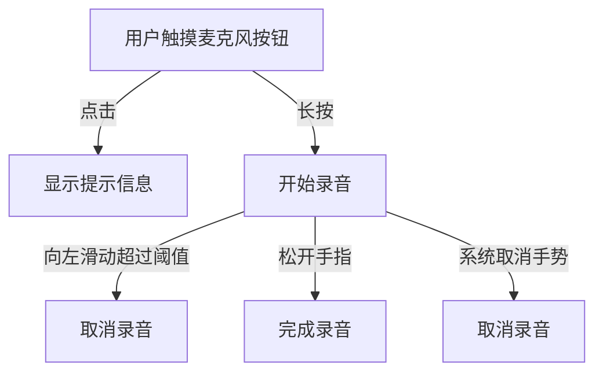

# Jetpack Compose 代码块分析：voiceRecordingGesture Modifier 实现

这段代码实现了一个用于录音的自定义 Modifier，提供了长按开始录音、滑动取消录音的手势交互功能。

## 业务逻辑分析

`voiceRecordingGesture` 修饰符实现了一个复杂的手势系统，用于语音录制场景。其主要功能包括：

1. 点击显示提示信息
2. 长按开始录音
3. 长按后向左滑动取消录音
4. 释放手指结束录音

整个手势系统的工作流程如下：



数据流动过程：

- 手势状态（如拖动距离）由 Compose 手势系统收集并通过回调传递给父组件
- 录音状态的变化通过 `onStartRecording`、`onFinishRecording` 和 `onCancelRecording` 回调传递给父组件
- 水平滑动进度通过 `horizontalSwipeProgress` 和 `onSwipeProgressChanged` 在父子组件间双向传递

这种设计允许父组件（RecordButton）根据手势状态更新 UI，同时保持手势逻辑的独立性和可复用性。

## Kotlin 语法特性

代码中使用了多种 Kotlin 高级语法特性：

1. **扩展函数**：`Modifier.voiceRecordingGesture()` 是对 Modifier 对象的扩展函数，允许以链式调用的方式应用自定义修饰符。

2. **高阶函数**：函数接收多个函数类型参数，如 `horizontalSwipeProgress: () -> Float` 和 `onSwipeProgressChanged: (Float) -> Unit`，这些参数本身就是函数。

3. **Lambda 表达式**：
   - 参数默认值使用 Lambda，如 `onClick: () -> Unit = {}`
   - 手势回调使用 Lambda 实现，如 `onDragStart = { ... }`

4. **默认参数值**：为多个参数提供了默认值，如 `swipeToCancelThreshold: Dp = 200.dp`，简化了 API 的使用。

5. **作用域函数**：使用 `this` 关键字返回修饰后的对象，支持链式调用。

这些函数式编程特性使代码更加简洁、可读性更高，并且能够更灵活地处理复杂的手势逻辑。

## Compose 技术解析

该代码使用了 Compose 的以下关键技术：

1. **自定义 Modifier**：通过扩展 `Modifier` 类创建自定义修饰符，将手势逻辑封装为可重用的组件。

2. **指针输入处理**：
   - 使用 `pointerInput` 修饰符捕获和处理触摸事件
   - 使用 `detectTapGestures` 处理点击事件
   - 使用 `detectDragGesturesAfterLongPress` 处理长按拖动手势

3. **手势检测与回调**：
   - 实现了完整的手势生命周期：开始、拖动、取消和结束
   - 通过回调函数传递手势状态变化，实现组件间的解耦

4. **单位转换**：将 `Dp` 类型的阈值转换为像素值 `toPx()`，以便在手势处理过程中进行像素级比较。

这种方式符合 Compose 的声明式 UI 设计理念，将手势逻辑与 UI 渲染分离，提高了代码的可维护性和可测试性。

## 最佳实践与改进建议

### 符合最佳实践的部分

1. **关注点分离**：手势逻辑被封装在专用的 Modifier 中，与 UI 渲染逻辑分离。
2. **参数化阈值**：将阈值作为参数，使组件更具可配置性。
3. **默认参数**：为可选参数提供合理的默认值，简化 API 使用。
4. **状态管理**：通过回调函数传递状态变化，而不是直接修改外部状态。

### 改进建议

1. **增加注释**：关键参数和逻辑应添加更详细的文档注释，特别是对阈值参数的作用解释。

2. **错误处理**：`onStartRecording` 返回一个 Boolean 值，但代码中没有处理这个返回值。考虑：

   ```kotlin
   val recordingStarted = onStartRecording()
   if (recordingStarted) {
       dragging = true
   } else {
       // 处理开始录音失败的情况
   }
   ```

3. **安全边界检查**：可以添加对拖动边界的检查，防止在某些极端情况下出现意外行为。

4. **性能优化**：考虑对频繁调用的 `onDrag` 回调中的计算进行优化，减少不必要的重复计算。

## 补充说明

### 理解难点

1. **双向数据流**：`horizontalSwipeProgress` 和 `onSwipeProgressChanged` 形成了双向数据流，这可能导致初学者难以理解数据的流动方向。

2. **取消录音的条件**：满足取消录音的条件需要同时满足三个条件：
   - 水平偏移量为负（向左滑动）
   - 水平偏移量绝对值超过阈值
   - 垂直偏移量在允许范围内（防止斜向滑动误触发）

### 使用场景

这种手势交互模式常见于现代聊天应用的语音消息录制功能，如 WhatsApp、Telegram 等。用户体验类似于：

- 点击麦克风图标显示提示（"按住说话"）
- 长按开始录音（可能伴随视觉和触觉反馈）
- 向左滑动取消录制（常见的"滑动取消"模式）
- 松开完成录音

### 参考资料

- [Compose 手势文档](https://developer.android.com/jetpack/compose/gestures)
- [Material Design 语音输入指南](https://material.io/design/sound/sound-resources.html)
