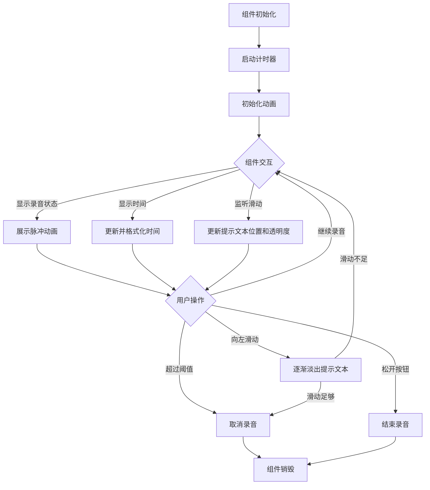
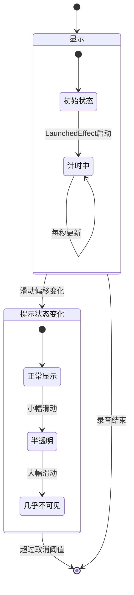

# RecordingIndicator 组件分析

## 1. 基本信息

### 参数列表

| 参数名 | 类型 | 默认值 | 作用 |
|-------|------|-------|------|
| swipeOffset | () -> Float | 无 | 获取当前水平滑动偏移量的函数，用于实现滑动取消录音的视觉反馈 |

### 主要用途

RecordingIndicator 是一个用于展示语音录制状态的界面组件，设计用于聊天应用中的语音消息录制功能。它提供以下功能：

- 显示录音时长计时器
- 提供录音状态的视觉指示（红色脉冲动画）
- 显示"滑动取消"提示，并根据滑动程度提供视觉反馈
- 与 RecordButton 组件配合使用，形成完整的语音录制体验

适用于需要语音输入功能的聊天、消息或社交应用中显示录音状态。

## 2. UI 组件结构

```plaintext
RecordingIndicator
└── Row (根容器)
    ├── Box (脉冲动画指示器)
    │   └── (红色圆形，带脉冲动画)
    ├── Text (录音时长显示)
    └── Box (滑动取消提示容器)
        └── Text (滑动取消提示文字)
```

## 3. 状态管理

### 内部状态

组件内部维护了以下状态：

1. **duration**: 使用 `remember { mutableStateOf(Duration.ZERO) }` 实现
   - 用途：记录当前录音持续时间
   - 更新方式：通过 LaunchedEffect 每秒递增 1 秒

2. **animatedPulse**: 通过 `rememberInfiniteTransition().animateFloat()` 实现
   - 用途：控制红色指示器的脉冲动画
   - 动画规格：在 1.0f 到 0.2f 之间，使用 tween(2000) 时长，RepeatMode.Reverse 模式无限循环

### 状态提升

组件通过参数 `swipeOffset: () -> Float` 接收外部状态：

- 滑动偏移量由父组件 UserInputText 管理
- 该值用于计算"滑动取消"提示的位置和透明度，实现滑动取消的视觉反馈

## 4. 交互事件

RecordingIndicator 本身不直接处理用户交互事件，交互主要由配套的 RecordButton 组件负责：

- 录音状态的切换
- 滑动手势的检测和处理
- 录音的开始、结束和取消

RecordingIndicator 仅负责根据传入的 swipeOffset 提供视觉反馈。

## 5. 自定义与样式

组件提供了以下视觉元素的样式定制：

1. **录音指示器**
   - 使用固定的 Color.Red 作为录音指示灯
   - 通过 graphicsLayer 的 scaleX/scaleY 属性实现脉冲效果
   - 使用 CircleShape 作为指示器形状

2. **时间显示**
   - 使用默认文本样式
   - 通过 duration.toComponents 格式化为 "MM:SS" 格式
   - 使用 alignByBaseline 对齐

3. **滑动取消提示**
   - 使用 MaterialTheme.typography.bodyLarge 样式
   - 水平居中对齐
   - 根据滑动偏移量动态调整水平位置和透明度

## 6. 性能考虑

1. **重组优化**
   - 使用 remember 缓存状态，避免重组时重新创建
   - LaunchedEffect 仅在组件首次进入组合时启动计时器协程

2. **动画性能**
   - 使用 rememberInfiniteTransition 进行声明式动画管理
   - 通过 graphicsLayer 实现高效的视觉变换，而非重新绘制

3. **潜在优化点**
   - 当滑动偏移量较大时，可考虑完全跳过滑动提示文本的绘制
   - 可考虑在不可见时暂停计时和动画

## 7. 组件工作流程



## 8. 状态转换图



## 9. 实现细节

### 计时器实现

```kotlin
var duration by remember { mutableStateOf(Duration.ZERO) }
LaunchedEffect(Unit) {
    while (true) {
        delay(1000)
        duration += 1.seconds
    }
}
```

### 脉冲动画实现

```kotlin
val infiniteTransition = rememberInfiniteTransition(label = "pulse")
val animatedPulse = infiniteTransition.animateFloat(
    initialValue = 1f,
    targetValue = 0.2f,
    animationSpec = infiniteRepeatable(
        tween(2000),
        repeatMode = RepeatMode.Reverse
    ),
    label = "pulse",
)
```

### 滑动取消提示的动态效果

```kotlin
val swipeThreshold = with(LocalDensity.current) { 200.dp.toPx() }
Text(
    modifier = Modifier
        .align(Alignment.Center)
        .graphicsLayer {
            translationX = swipeOffset() / 2
            alpha = 1 - (swipeOffset().absoluteValue / swipeThreshold)
        },
    // ...
)
```
