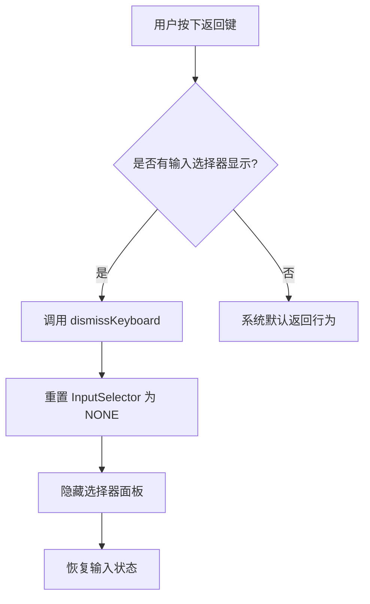

# Jetpack Compose 代码块分析: 返回导航拦截处理

## 代码块

```kotlin
// Intercept back navigation if there's a InputSelector visible
if (currentInputSelector != InputSelector.NONE) {
    BackHandler(onBack = dismissKeyboard)
}
```

## 业务逻辑分析

这段代码实现了 Android 返回键的拦截处理，是 Jetpack Compose 应用中的常见模式。代码逻辑处理用户在聊天输入界面显示表情、图片等选择器面板时的返回按键行为。

### 核心功能

当用户激活任意输入选择器（如表情、地图、私信等）后，按下系统返回键时：

- 不会退出当前页面或应用
- 而是关闭当前显示的输入选择器面板
- 恢复到正常的文本输入状态

### 数据流动



### 状态管理

该代码块关注 `currentInputSelector` 状态，这是一个 `InputSelector` 类型的枚举值，使用 `rememberSaveable` 维持状态。状态转换如下：

- 初始状态：`InputSelector.NONE`
- 有选择器显示时：其他枚举值如 `InputSelector.EMOJI` 等
- 返回按钮按下时：重置为 `InputSelector.NONE`

## Kotlin 语法特性

### 条件语句与 lambda 表达式

代码利用简洁的 if 条件语句判断当前状态，条件满足时声明式地调用 `BackHandler`。`dismissKeyboard` 作为 lambda 表达式传递给 `BackHandler` 组件的 `onBack` 参数，遵循 Kotlin 函数式编程风格。

### 状态变量声明与操作

```kotlin
var currentInputSelector by rememberSaveable { mutableStateOf(InputSelector.NONE) }
val dismissKeyboard = { currentInputSelector = InputSelector.NONE }
```

代码展示了 Kotlin 中状态管理的典型模式：

- 使用 `by` 委托模式简化 state 访问
- 使用 lambda 表达式封装状态重置逻辑

## Compose 技术解析

### BackHandler 组件

`BackHandler` 是 Compose 中的系统交互组件，来自 `androidx.activity.compose` 包，专门用于处理系统返回按钮事件。当激活时，它会消费返回事件并执行指定的回调，防止默认行为（如退出页面）发生。

### 条件性 UI 组件

这段代码展示了 Compose 中条件渲染模式：`BackHandler` 仅在 `currentInputSelector != InputSelector.NONE` 条件满足时才被添加到组合中，这是 Compose 声明式 UI 范式的体现。

### 状态驱动 UI

代码体现了 Compose 的"状态驱动 UI"理念：

- `currentInputSelector` 状态决定是否显示 `BackHandler`
- 状态变化自动触发 UI 重组
- 状态重置会级联影响到其他依赖该状态的 UI 元素

## 最佳实践与改进建议

### 符合最佳实践的部分

1. **状态提升与集中管理**：
   - 将输入选择器状态提升到 `UserInput` 函数
   - 提供统一的状态重置方法

2. **返回拦截模式**：
   - 遵循 Android 交互设计指南
   - 先关闭内部 UI 层次，再退出页面

3. **状态保存**：
   - 使用 `rememberSaveable` 而非普通的 `remember`，确保配置变更时状态不丢失

### 可能的改进

1. **增加过渡动画**：
   - 可考虑在关闭选择器面板时添加动画效果提升用户体验

2. **更具描述性的注释**：
   - 当前注释简单描述了功能，可添加更多关于交互模式的解释

## 补充说明

### 相关资源

- [BackHandler 官方文档](https://developer.android.com/reference/kotlin/androidx/activity/compose/package-summary#BackHandler(kotlin.Boolean,kotlin.Function0))
- [Compose 中的后退行为处理](https://developer.android.com/jetpack/compose/navigation#back-handling)

### 使用场景

这种模式在很多有多层次 UI 的场景中非常常见：

- 输入法面板与表情选择器
- 底部弹出菜单
- 筛选选项面板
- 内嵌媒体预览
