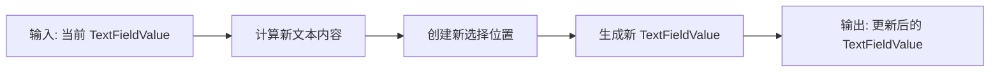

# TextFieldValue.addText 函数分析

## 业务逻辑分析

`TextFieldValue.addText` 是一个扩展函数，用于在文本输入框的当前选择位置插入新文本。这个函数是 Jetchat 应用中用户输入处理的关键组件，主要应用于表情选择器和其他输入选择器向输入框添加内容的场景。

函数的核心功能是：

1. 在当前文本选择范围（可能是光标位置或选中的文本片段）插入新字符串
2. 更新文本选择范围到新文本的末尾
3. 返回包含更新后文本和选择范围的新 TextFieldValue 对象

数据流动过程：

这个函数是无状态的纯函数，不涉及状态管理或副作用处理，符合函数式编程范式。它被设计为 TextFieldValue 的扩展函数，使其可以方便地在文本输入相关的代码中链式调用。

## Kotlin 语法特性

代码利用了多个 Kotlin 语法特性：

1. **扩展函数**：`addText` 被定义为 `TextFieldValue` 类的扩展函数，允许开发者像调用实例方法一样调用它（`textFieldValue.addText(newString)`），增强了代码的可读性和表达性。

2. **不可变性设计**：函数通过 `copy` 方法创建并返回一个新的 `TextFieldValue` 实例，而不是修改原始对象，遵循了不可变对象的设计原则。

3. **字符串操作**：使用 `replaceRange` 函数在指定位置插入新文本，这是 Kotlin 标准库提供的字符串处理函数。

4. **命名参数**：在创建 `TextRange` 和调用 `copy` 方法时使用了命名参数，增强了代码可读性。

## Compose 技术解析

尽管这个函数本身不是 Composable 函数，但它与 Jetpack Compose 的文本输入处理紧密相关：

1. **TextFieldValue**：这是 Compose UI 文本输入的核心数据类，封装了文本内容和选择状态，支持不可变状态管理模式。

2. **TextRange**：用于表示文本选择范围的类，通过 start 和 end 属性定义选择的开始和结束位置。

3. **与状态管理的结合**：在更广泛的应用中，这个函数通常与 `remember`、`mutableStateOf` 等状态管理 API 一起使用，当调用 `addText` 时会触发 Compose UI 的重组。

## 最佳实践与改进建议

函数实现遵循了多个最佳实践：

1. **纯函数设计**：没有副作用，输出仅依赖于输入，使代码更易于测试和理解。

2. **不可变性**：返回新对象而不是修改原对象，符合 Compose 状态管理的不可变模式。

3. **单一职责**：函数只负责一件事：在选定位置添加文本并更新选择范围。

可能的改进建议：

1. **异常处理**：可以添加对边缘情况的处理，如选择范围超出文本长度的情况。

2. **光标位置选项**：可以提供额外参数，允许调用者指定插入后光标应该位于何处（如文本开始、结束或保持在插入点）。

## 补充说明

这个函数在 Jetchat 应用中主要用于多种输入选择器（如表情选择器）向文本输入框添加内容。使用场景包括：

1. 用户从表情选择器中选择表情时，将表情添加到当前输入文本中
2. 可能的未来扩展，如添加@提及、贴纸等其他元素

值得注意的是，`TextFieldValue.selection` 可能代表两种情况：

- 如果 `start == end`，它代表光标位置
- 如果 `start != end`，它代表选中的文本范围

该函数处理这两种情况的方式相同：在选择范围内插入新文本（若有选中文本则替换它）并将光标移动到新添加内容的末尾。
