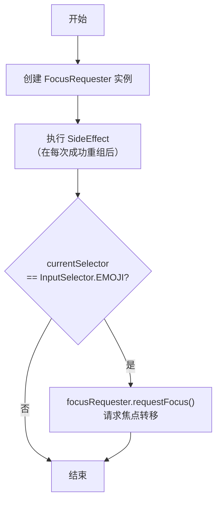

# Jetpack Compose 代码块分析

## 代码块

```kotlin
// Request focus to force the TextField to lose it
val focusRequester = FocusRequester()
// If the selector is shown, always request focus to trigger a TextField.onFocusChange.
SideEffect {
    if (currentSelector == InputSelector.EMOJI) {
        focusRequester.requestFocus()
    }
}
```

## 分析详情

### 业务逻辑分析

- **核心功能**: 这段代码的主要目的是管理 Jetpack Compose 中的焦点。具体来说，它用于在特定的输入选择器（在这里是 Emoji 选择器）显示时，准备并可能触发一次焦点请求。
- **交互流程**:



- **设计意图**: 其目的是确保当 Emoji 选择器面板展开时，能够将焦点从主文本输入框 (`UserInputTextField`) 转移到 Emoji 选择器本身（或其容器）。这有助于管理软键盘的显示/隐藏，并通过触发文本输入框的 `onFocusChanged` 回调来更新相关的 UI 状态。`focusRequester` 会被传递给 `EmojiSelector` 组件，并在那里通过 `Modifier.focusRequester()` 应用到实际的 UI 元素上，使得 `requestFocus()` 调用生效。
- **状态管理**: 依赖于外部传入的 `currentSelector` 状态来决定是否执行焦点请求。

### Kotlin 语法特性

- **`val focusRequester = FocusRequester()`**: 使用 `val` 声明一个不可变的局部变量 `focusRequester`，并立即初始化 `FocusRequester` 的实例。
- **`SideEffect { ... }`**: 虽然是 Compose 的一部分，但其内部使用了 Kotlin 的 Lambda 表达式 `{ ... }` 来定义需要在重组后执行的操作。
- **`if (currentSelector == InputSelector.EMOJI)`**: 标准的 Kotlin `if` 条件判断语句，用于检查枚举类型的值。
- **`focusRequester.requestFocus()`**: 调用 `FocusRequester` 实例的方法。

### Compose 技术解析

- **`FocusRequester`**: Compose 提供的用于显式控制焦点的 API。通过创建一个 `FocusRequester` 实例，并将其与 `Modifier.focusRequester()` 结合使用，可以命令式地请求某个 Composable 获取焦点。在此代码块中，仅创建了实例，实际的应用发生在 `EmojiSelector` 内部。
- **`SideEffect`**: Compose 的一个副作用 API。它用于执行那些需要在每次成功重组后运行、但本身不直接参与 UI 描述的命令式代码（副作用）。例如，与外部系统交互、日志记录或像这里一样触发焦点请求。使用 `SideEffect` 可以确保 `requestFocus()` 调用发生在 UI 可能已经更新之后。
- **焦点管理**: 这是 Compose 中处理用户交互焦点的重要部分。通过 `FocusRequester` 和 `Modifier.onFocusChanged` 等，可以构建复杂的焦点切换逻辑。

### 最佳实践与改进建议

- **符合实践**:
  - 使用 `FocusRequester` 是 Compose 中处理程序化焦点请求的标准方式。
  - 将命令式的焦点请求放在 `SideEffect` 中执行是正确的，因为它需要在 Compose 的声明性描述之外与焦点系统交互，并且通常依赖于组合的完成。
- **改进建议**:
  - **注释**: `// Request focus to force the TextField to lose it` 这个注释可以更精确。代码本身并不直接 *强制* TextField 失去焦点，而是 *请求* Emoji 选择器获得焦点。当 Emoji 选择器成功获得焦点后，TextField 自然会失去焦点。更准确的注释可能是："// 如果 Emoji 选择器可见，则请求其获取焦点，间接使 TextField 失去焦点。" 或者 "// 准备并触发 Emoji 选择器的焦点请求"。
  - **条件检查**: 确保 `currentSelector` 的状态更新与 `SideEffect` 的执行时机符合预期，避免不必要的焦点请求。

### 补充说明

- 这段代码是实现聊天输入框中常见交互模式（点击按钮展开 Emoji 面板，同时输入框失去焦点并可能隐藏键盘）的关键部分。
- 它展示了 Compose 如何桥接声明式 UI 和命令式操作（如焦点控制）。
- `focusRequester` 的实例需要被传递给实际需要获取焦点的 Composable（即 `EmojiSelector`），并在其修饰符链中使用 `Modifier.focusRequester(focusRequester)`。
