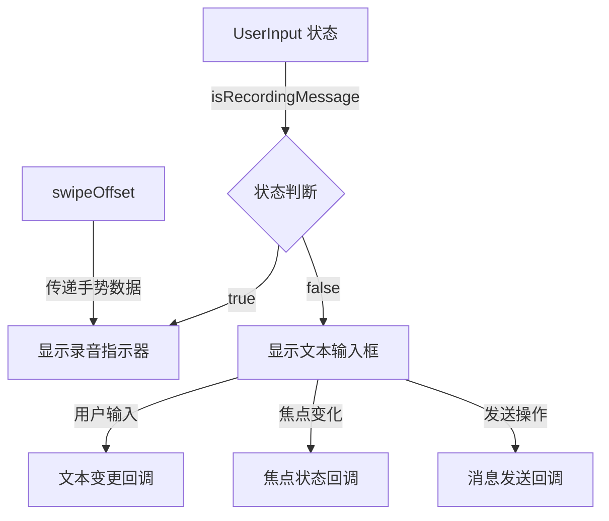

# 代码块分析报告：消息输入组件动态内容切换实现

## 业务逻辑分析

该代码块实现了聊天应用中输入区域的核心动态切换功能，根据当前是否处于录音状态来展示不同的 UI 界面。

### 功能实现

- 通过 `AnimatedContent` 实现两种不同状态 UI 的平滑过渡动画
- 基于 `isRecordingMessage` 布尔状态决定显示文本输入框还是录音指示器
- 使用 `Box` 容器作为两种状态的公共容器，确保布局一致性
- 为文本输入组件添加无障碍支持，提高应用的可访问性

### 组件交互与数据流



### 状态管理

- `isRecordingMessage`：控制是否显示录音界面
- `swipeOffset`：管理滑动取消录音的手势状态
- `textFieldValue`：管理文本输入的内容
- `focusState`：管理文本框的焦点状态

这些状态通过参数传递形式进行状态提升，在更高层级的父组件中进行管理，保证了组件的可重用性和状态的一致性。

## Kotlin 语法特性

### 高阶函数与 Lambda 表达式

1. **AnimatedContent 内容 Lambda**

   ```kotlin
   AnimatedContent(...) { recording -> ... }
   ```

   这里使用 Lambda 表达式作为 AnimatedContent 的内容构建器，参数 `recording` 代表当前的目标状态。

2. **闭包与状态引用**

   ```kotlin
   RecordingIndicator { swipeOffset.value }
   ```

   通过 Lambda 表达式创建一个函数闭包，捕获外部 `swipeOffset` 状态并提供给 RecordingIndicator 组件。

### 修饰符链式调用

代码中多处使用了 Kotlin 的链式调用语法，如：

```kotlin
Modifier
    .fillMaxWidth()
    .semantics { ... }
```

这种流式 API 设计使代码更简洁、更具可读性。

### DSL 结构

整个代码块采用了 Compose 的 DSL 结构，通过嵌套函数调用构建 UI 树，这是 Kotlin 特有的 DSL 构建能力的体现。

## Compose 技术解析

### 可组合函数与重组

代码使用 `AnimatedContent` 可组合函数实现 UI 状态变化时的平滑动画过渡。当 `isRecordingMessage` 状态变化时，Compose 会自动重组并触发过渡动画。

### 状态驱动 UI

典型的声明式 UI 模式，基于 `isRecordingMessage` 状态来决定显示的内容：

```kotlin
if (recording) {
    RecordingIndicator { swipeOffset.value }
} else {
    UserInputTextField(...)
}
```

### 布局策略

- 使用 `weight(1f)` 确保 AnimatedContent 占据父布局的剩余空间
- `fillMaxHeight()` 保证组件垂直方向填充父容器
- `Box` 容器作为布局容器，确保子组件可以根据需要定位

### 无障碍支持

代码中通过 `.semantics` 修饰符为文本输入字段添加了无障碍描述和键盘状态属性：

```kotlin
.semantics {
    contentDescription = a11ylabel
    keyboardShownProperty = keyboardShown
}
```

这使得屏幕阅读器可以识别该组件并提供合适的反馈。

## 最佳实践与改进建议

### 最佳实践

1. **状态提升**：通过参数传递状态，而不是在组件内部管理，符合 Compose 的状态提升原则
2. **单一职责**：将 UI 显示与状态变更分离，RecordingIndicator 和 UserInputTextField 各自负责自己的渲染逻辑
3. **动画过渡**：使用 AnimatedContent 实现平滑的状态转换，提升用户体验
4. **无障碍支持**：添加了适当的语义属性，增强应用的可访问性

### 改进建议

1. **状态处理优化**：可以考虑使用密封类（sealed class）替代布尔值来表示更复杂的状态

   ```kotlin
   sealed class InputMode {
       object Text : InputMode()
       data class Recording(val duration: Duration = Duration.ZERO) : InputMode()
   }
   ```

2. **动画定制**：可以为 AnimatedContent 添加自定义的转场动画，如淡入淡出或滑动效果

   ```kotlin
   AnimatedContent(
       targetState = isRecordingMessage,
       transitionSpec = {
           fadeIn() + slideInVertically() with fadeOut() + slideOutVertically()
       }
   )
   ```

3. **性能优化**：对于复杂的 UI 结构，可以考虑使用 `remember` 缓存不需要重组的部分

## 补充说明

该代码是聊天输入组件的核心部分，展示了 Jetpack Compose 中如何处理不同状态下的 UI 切换。整个实现遵循了 Material Design 的设计理念，通过动画提供流畅的用户体验。

相关官方文档：

- [AnimatedContent API](https://developer.android.com/jetpack/compose/animation#animatedcontent)
- [Compose 状态管理](https://developer.android.com/jetpack/compose/state)
- [Compose 无障碍](https://developer.android.com/jetpack/compose/accessibility)

通过这种状态驱动的 UI 设计，应用能够灵活响应用户交互，提供直观且功能丰富的消息输入体验。
