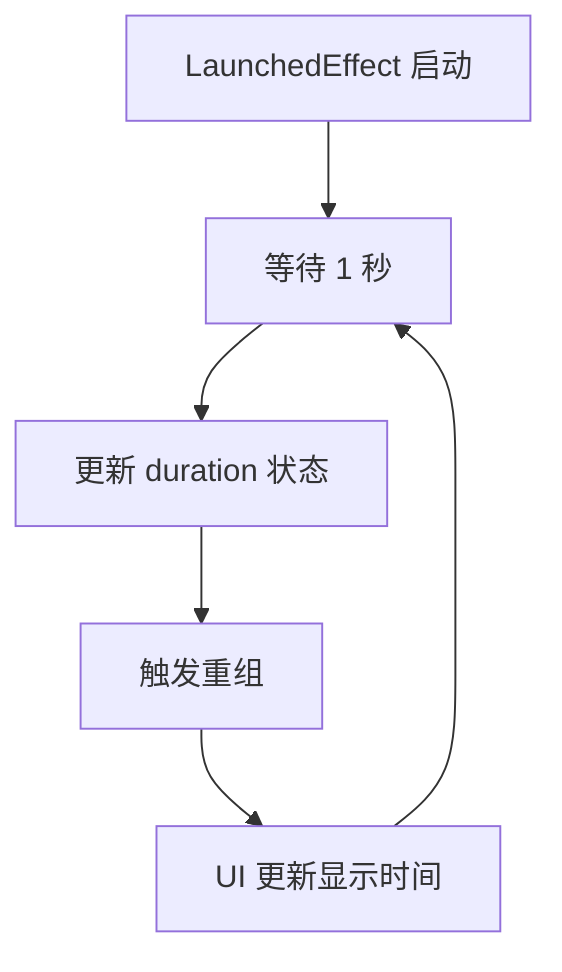

# 代码块分析报告：无限计时器循环

## 代码块

```kotlin
LaunchedEffect(Unit) {
    while (true) {
        delay(1000)
        duration += 1.seconds
    }
}
```

## 业务逻辑分析

这段代码实现了一个简单但关键的功能：在录音指示器中创建一个计时器，用于显示当前录音持续的时间。它通过不断增加 `duration` 状态变量的值来实现计时功能。

### 功能实现

- 代码位于 `RecordingIndicator` Composable 函数内部
- 创建一个无限循环，每秒更新一次 `duration` 状态
- 更新后的持续时间会通过 UI 以分:秒格式显示给用户

### 数据流动过程



### 状态管理

- `duration` 是一个由 `remember` 管理的 `MutableState<Duration>`，初始值为 `Duration.ZERO`
- 每次循环迭代会将 `duration` 增加 1 秒
- 由于状态变化，Compose 框架会自动重组依赖此状态的 UI 部分

## Kotlin 语法特性

### 协程与结构化并发

这段代码展示了 Kotlin 协程的几个重要特性：

1. **LaunchedEffect**：Compose 的副作用 API，用于在组合中安全地启动协程
   - 参数 `Unit` 表示该效应只在首次组合时运行一次
   - 当组件离开组合时，协程会自动取消

2. **无限循环**：使用 `while (true)` 创建的永久运行循环
   - 依赖协程的可取消性，不会阻塞主线程
   - 通过结构化并发确保资源正确释放

3. **suspend 函数**：`delay()` 是一个 suspend 函数，可以暂停协程而不阻塞线程
   - 允许其他协程和 UI 渲染在等待期间执行

4. **Kotlin 时间 DSL**：使用 `1.seconds` 扩展属性创建时间间隔
   - 这是 Kotlin 标准库中 `kotlin.time` 包提供的类型安全时间 API

## Compose 技术解析

### 副作用管理

`LaunchedEffect` 是 Compose 中处理副作用的标准方式之一，具有以下特点：

- **生命周期感知**：与 Composable 的生命周期绑定，当组件被移除时自动取消
- **重组安全**：即使函数重组多次，`LaunchedEffect(Unit)` 也只会启动一次协程
- **状态隔离**：副作用与 UI 渲染逻辑分离，使代码更易于理解和测试

### 状态驱动 UI

这段代码展示了 Compose 的核心理念之一：状态驱动 UI

1. 状态（`duration`）的变化触发 UI 重组
2. UI 始终反映最新的状态值
3. 状态变化的源头（协程）与 UI 显示分离

## 最佳实践与改进建议

### 符合最佳实践的部分

- **使用 LaunchedEffect 处理副作用**：确保协程与组件生命周期正确绑定
- **不阻塞主线程**：使用协程的 `delay()` 而非 `Thread.sleep()`
- **状态驱动设计**：通过更新状态而非直接操作 UI 来实现动态变化

### 潜在改进

1. **考虑内存泄漏**：虽然理论上 `LaunchedEffect` 会在离开组合时取消，但确保协程不会意外地持续运行很重要

2. **错误处理**：添加 try-catch 块处理可能的异常

   ```kotlin
   LaunchedEffect(Unit) {
       try {
           while (true) {
               delay(1000)
               duration += 1.seconds
           }
       } catch (e: Exception) {
           // 处理异常
       }
   }
   ```

3. **精确计时**：当前实现可能会随时间累积误差，可以考虑基于系统时间的计算方式

   ```kotlin
   LaunchedEffect(Unit) {
       val startTime = System.currentTimeMillis()
       while (true) {
           delay(1000)
           duration = ((System.currentTimeMillis() - startTime) / 1000).seconds
       }
   }
   ```

4. **取消优化**：添加取消检查以便更快响应取消信号

   ```kotlin
   LaunchedEffect(Unit) {
       while (isActive) { // 检查协程是否仍然活跃
           delay(1000)
           duration += 1.seconds
       }
   }
   ```

## 补充说明

这段代码是实现录音时间显示的核心部分，与 UI 组件（如脉动的录音图标和时间文本显示）配合工作。在 `RecordingIndicator` 函数中，`duration` 变量通过 `toComponents` 方法被格式化为 "MM:SS" 格式并显示在 UI 上。

相关官方文档：

- [Compose 中的副作用](https://developer.android.com/jetpack/compose/side-effects)
- [Kotlin 协程](https://kotlinlang.org/docs/coroutines-overview.html)
- [Kotlin 时间 API](https://kotlinlang.org/docs/kotlin-tour-ranges-progressions.html#kotlin-time)
