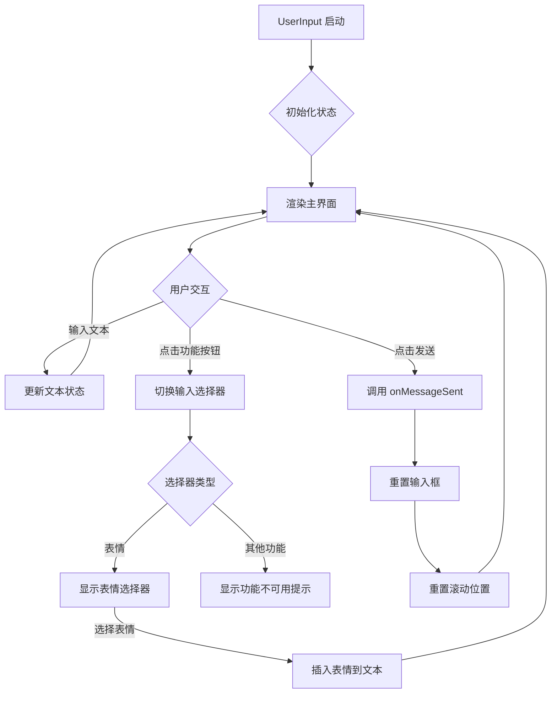
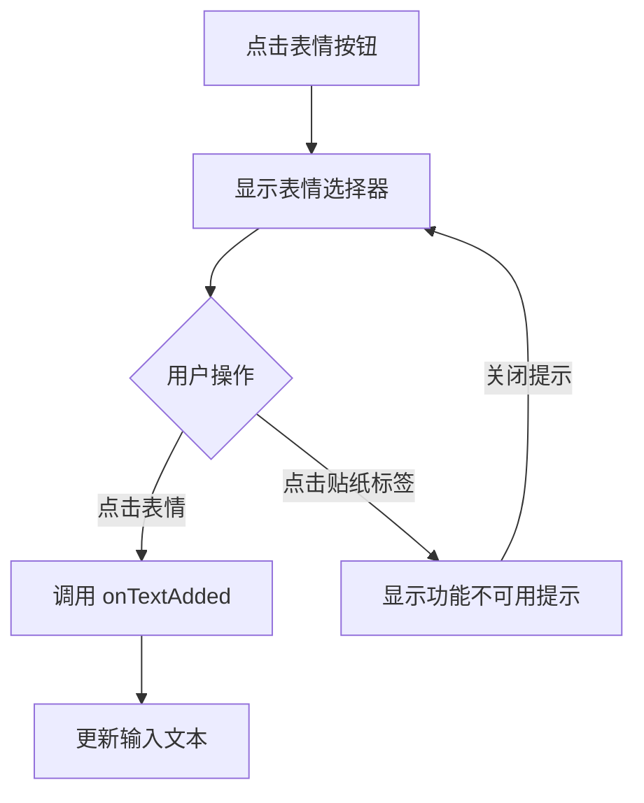

# UserInput.kt 分析报告

## 文件基本信息

- **文件名称**：UserInput.kt
- **文件路径**：app/src/main/java/com/example/compose/jetchat/conversation/UserInput.kt
- **主要功能**：实现聊天应用用户输入界面，包括文本输入、消息发送和辅助功能选择器（表情、媒体等）
- **技术要点**：Jetpack Compose UI、状态管理、动画、输入处理、无障碍支持

## 语法元素分析

### 语法元素概览

- **包声明**：`com.example.compose.jetchat.conversation`
- **导入声明**：主要导入 Jetpack Compose 相关类库、Android 基础组件和 Kotlin 标准库
- **元素统计**：

  | 元素类型 | 数量 | 备注 |
  |---|---|---|
  | 枚举类   | 2    | InputSelector、EmojiStickerSelector |
  | 扩展函数 | 1    | TextFieldValue.addText |
  | 函数    | 13   | 包括 Composable 函数 |
  | 顶层属性 | 3    | KeyboardShownKey、emojis 和 EMOJI_COLUMNS |

### 枚举类分析

#### InputSelector

- **类型**：枚举类
- **职责描述**：定义用户输入界面的不同选择器状态
- **枚举值**：NONE、MAP、DM、EMOJI、PHONE、PICTURE
- **使用场景**：在 UserInput 组件中控制不同输入模式的切换和显示

#### EmojiStickerSelector

- **类型**：枚举类
- **职责描述**：定义表情选择器的两种模式
- **枚举值**：EMOJI、STICKER
- **使用场景**：在表情选择面板中控制表情或贴纸的显示

### 主要 Composable 函数分析

#### UserInput

- **函数签名**：`@Composable fun UserInput(onMessageSent: (String) -> Unit, modifier: Modifier = Modifier, resetScroll: () -> Unit = {})`
- **函数职责**：主输入界面组件，整合文本输入区、功能选择器和扩展面板
- **参数分析**：
  - `onMessageSent`：消息发送回调函数
  - `modifier`：组件样式修饰符
  - `resetScroll`：重置滚动位置的回调函数
- **状态管理**：
  - `currentInputSelector`：当前输入选择器状态
  - `textState`：文本输入值状态
  - `textFieldFocusState`：文本框焦点状态
- **组件结构**：

  ```
  UserInput/
  ├── Surface/
  │   └── Column/
  │       ├── UserInputText/          # 文本输入区域
  │       │   └── Row/
  │       │       ├── AnimatedContent/ # 输入和录音状态切换
  │       │       └── RecordButton/    # 录音按钮
  │       ├── UserInputSelector/       # 功能选择器按钮组
  │       └── SelectorExpanded/        # 展开的功能选择器面板
  ```

#### UserInputText

- **函数签名**：`@Composable private fun UserInputText(...)`
- **函数职责**：实现文本输入和语音输入的切换界面
- **核心状态**：
  - `isRecordingMessage`：是否处于录音状态
  - `swipeOffset`：滑动手势偏移量
- **UI 组件**：
  - 文本输入区域
  - 录音指示器

#### EmojiSelector

- **函数签名**：`@Composable fun EmojiSelector(onTextAdded: (String) -> Unit, focusRequester: FocusRequester)`
- **函数职责**：表情选择器面板，提供表情符号选择
- **参数分析**：
  - `onTextAdded`：选择表情后的回调函数
  - `focusRequester`：焦点请求控制器
- **组件结构**：

  ```
  EmojiSelector/
  ├── Column/
  │   ├── Row/ (Tab 选项卡)
  │   │   ├── ExtendedSelectorInnerButton/ (Emoji)
  │   │   └── ExtendedSelectorInnerButton/ (Sticker)
  │   └── Row/
  │       └── EmojiTable/ (表情网格)
  └── NotAvailablePopup/ (贴纸功能不可用提示)
  ```

### 扩展函数分析

#### TextFieldValue.addText

- **扩展类型**：TextFieldValue
- **函数签名**：`private fun TextFieldValue.addText(newString: String): TextFieldValue`
- **功能描述**：在当前文本字段的选中位置插入新文本，并更新光标位置
- **使用场景**：当用户选择表情符号时，将表情添加到输入框中

### 全局常量分析

- **EMOJI_COLUMNS**：表情选择器每行显示的表情数量，值为 10
- **emojis**：预定义的表情符号列表，包含各种表情符号的 Unicode 表示
- **KeyboardShownKey**：用于无障碍语义属性的键，标记键盘是否显示

## 流程分析

### UserInput 组件主要逻辑流程



### 表情选择流程



## UI 组件树形结构

```
UserInput/                          # 主输入容器
├── Surface/                        # 带阴影的表面容器
│   └── Column/                     # 垂直排列容器
│       ├── UserInputText/          # 文本输入区域
│       │   └── Row/                # 水平排列文本输入和录音按钮
│       │       ├── AnimatedContent/ # 动画内容切换容器
│       │       │   └── Box/         # 布局容器
│       │       │       ├── UserInputTextField/ # 文本输入框（非录音状态）
│       │       │       └── RecordingIndicator/ # 录音指示器（录音状态）
│       │       └── RecordButton/    # 录音按钮
│       ├── UserInputSelector/       # 功能选择器按钮区域
│       │   └── Row/                 # 水平排列的按钮组
│       │       ├── InputSelectorButton/ (Emoji) # 表情按钮
│       │       ├── InputSelectorButton/ (DM)    # @提及按钮
│       │       ├── InputSelectorButton/ (Photo) # 照片按钮
│       │       ├── InputSelectorButton/ (Map)   # 位置按钮
│       │       ├── InputSelectorButton/ (Phone) # 视频通话按钮
│       │       ├── Spacer/                      # 弹性空间
│       │       └── Button/ (Send)               # 发送按钮
│       └── SelectorExpanded/        # 展开的功能选择器面板
│           └── Surface/             # 带阴影的表面容器
│               ├── EmojiSelector/   # 表情选择器（EMOJI模式）
│               │   └── Column/      
│               │       ├── Row/ (Tab栏)
│               │       └── EmojiTable/ (表情网格)
│               └── FunctionalityNotAvailablePanel/ # 功能不可用面板（其他模式）
```

## Kotlin 语法特性分析

- **扩展函数**：用于扩展 TextFieldValue 类添加文本功能
- **高阶函数**：大量使用回调函数处理用户交互事件
- **作用域函数**：使用 apply 函数设置转换状态
- **Lambda 表达式**：用于简化事件处理和状态更新
- **运算符重载**：使用 by 委托进行属性委托
- **空安全**：合理使用非空断言和安全调用操作符
- **属性委托**：使用 remember 和 mutableStateOf 管理状态
- **命名参数**：提高函数调用可读性

## Jetpack Compose 特性分析

- **状态管理**：使用 remember 和 rememberSaveable 管理 UI 状态
- **副作用处理**：使用 LaunchedEffect 和 SideEffect 处理副作用
- **动画**：使用 AnimatedContent 和 AnimatedVisibility 处理 UI 转换
- **可组合函数**：遵循 Compose 的声明式 UI 模式
- **修饰符链**：使用 Modifier 链构建复杂的 UI 属性
- **主题**：使用 MaterialTheme 确保 UI 风格一致性
- **无障碍支持**：添加内容描述和语义属性

## API 使用分析

### 重要 API

| API 名称 | 用途 | 文档链接 |
|---|---|---|
| Jetpack Compose | 声明式 UI 框架 | [链接](https://developer.android.com/jetpack/compose) |
| Compose Animation | UI 动画效果 | [链接](https://developer.android.com/jetpack/compose/animation) |
| Compose State | 状态管理 | [链接](https://developer.android.com/jetpack/compose/state) |
| Material3 | 材料设计组件 | [链接](https://developer.android.com/jetpack/compose/designsystems/material3) |

## 优缺点分析

### 优点

1. **组件化设计**：将 UI 分解为可重用的小型组件
2. **状态管理清晰**：明确的状态定义和管理机制
3. **动画体验流畅**：利用 Compose 动画 API 提供流畅过渡
4. **无障碍支持良好**：添加语义属性和内容描述
5. **代码结构清晰**：功能模块划分合理

### 改进空间

1. **功能完整性**：多数功能显示"不可用"，需要实际实现
2. **性能优化**：表情符号列表可以进一步优化加载性能
3. **代码复用**：某些 UI 逻辑可以进一步抽象为可重用组件
4. **错误处理**：缺少明确的错误处理机制
5. **测试覆盖**：应添加更多的单元测试和 UI 测试
