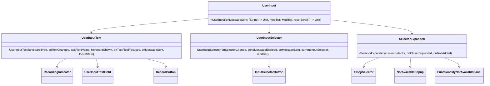
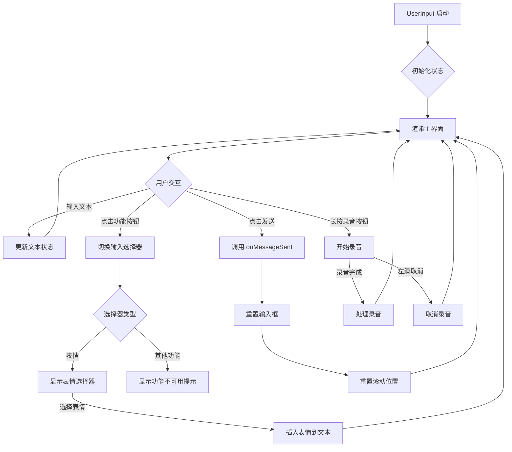
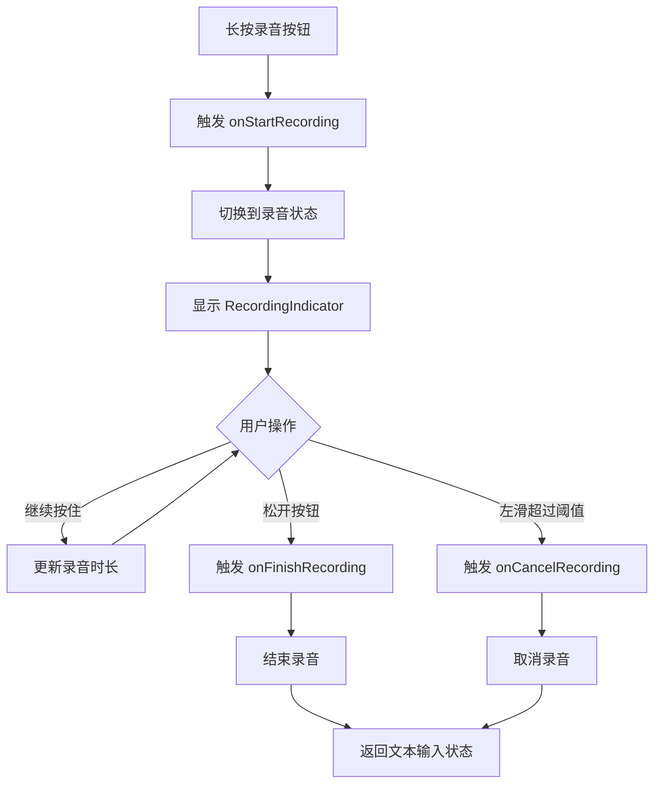
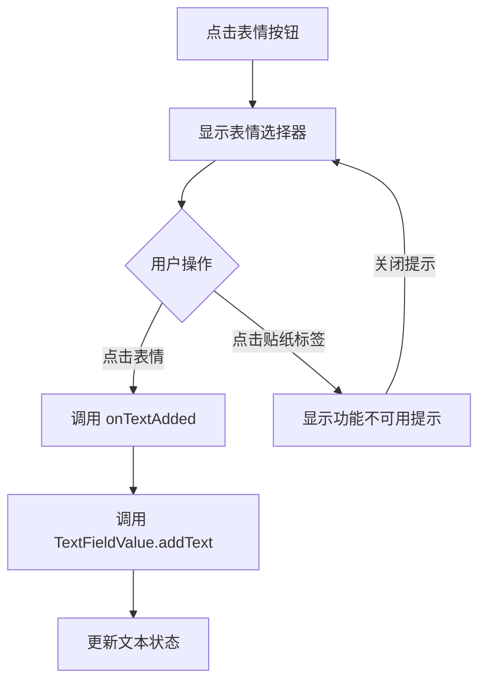

# UserInput.kt 分析报告

## 文件基本信息

- **文件名称**：UserInput.kt
- **文件路径**：app/src/main/java/com/example/compose/jetchat/conversation/UserInput.kt
- **主要功能**：实现聊天应用用户输入界面，包括文本输入、消息发送、表情选择和语音录制等功能
- **技术要点**：Jetpack Compose UI、状态管理、动画效果、手势处理、焦点管理、无障碍支持

## 语法元素分析

### 语法元素概览

- **包声明**：`com.example.compose.jetchat.conversation`
- **导入声明**：
  - Jetpack Compose UI 组件和动画相关（如 AnimatedContent、AnimatedVisibility 等）
  - Compose 基础布局和状态管理（如 Column、Row、remember 等）
  - Material Design 组件（如 Button、IconButton、Surface 等）
  - 其他工具类和资源（如 stringResource、TextRange、Duration 等）
- **元素统计**：

  | 元素类型 | 数量 | 备注 |
  |---|---|---|
  | 枚举类 | 2 | InputSelector、EmojiStickerSelector |
  | 扩展函数 | 1 | TextFieldValue.addText |
  | Composable 函数 | 11 | 包括公开和私有的可组合函数 |
  | 非 Composable 函数 | 2 | 辅助函数 |
  | 顶层属性 | 3 | KeyboardShownKey、emojis 和 EMOJI_COLUMNS |
  | 语义属性 | 1 | keyboardShownProperty |

### 枚举类分析

#### InputSelector

- **类型**：枚举类
- **职责描述**：定义用户输入界面的不同选择器状态
- **枚举值**：
  - `NONE`：默认状态，无选择器激活
  - `MAP`：位置选择器
  - `DM`：直接消息（@提及）选择器
  - `EMOJI`：表情选择器
  - `PHONE`：视频通话选择器
  - `PICTURE`：图片选择器
- **使用场景**：控制输入界面底部显示的功能面板，决定当前激活的选择器类型

#### EmojiStickerSelector

- **类型**：枚举类
- **职责描述**：定义表情选择器的两种模式
- **枚举值**：
  - `EMOJI`：表情符号模式
  - `STICKER`：贴纸模式
- **使用场景**：在表情选择面板中控制显示表情符号或贴纸（虽然贴纸功能未实现）

### 主要 Composable 函数分析

#### UserInput

- **函数签名**：`@Composable fun UserInput(onMessageSent: (String) -> Unit, modifier: Modifier = Modifier, resetScroll: () -> Unit = {})`
- **函数职责**：主输入界面组件，整合文本输入区、功能选择器和扩展面板
- **参数分析**：
  - `onMessageSent`：消息发送回调函数，接收输入的文本消息
  - `modifier`：组件样式修饰符，允许自定义布局
  - `resetScroll`：重置滚动位置的回调函数，在消息发送后调用
- **状态管理**：
  - `currentInputSelector`：当前输入选择器状态，使用 rememberSaveable 保存
  - `textState`：文本输入值状态，使用 TextFieldValue.Saver 自定义状态保存
  - `textFieldFocusState`：文本框焦点状态
- **函数流程**：
  1. 初始化状态和回调函数
  2. 设置后退键拦截器（当选择器处于活动状态时）
  3. 渲染主界面，包括输入文本区域、选择器按钮区和扩展面板
  4. 根据用户交互更新状态并触发回调
- **UML 类图**：



#### UserInputText

- **函数签名**：`@Composable private fun UserInputText(...)`
- **函数职责**：实现文本输入和语音输入的切换界面
- **核心状态**：
  - `isRecordingMessage`：是否处于录音状态
  - `swipeOffset`：滑动手势偏移量，用于录音取消手势
- **关键组件**：
  - `AnimatedContent`：在文本输入和录音状态之间切换的动画容器
  - `UserInputTextField`：文本输入字段
  - `RecordingIndicator`：录音状态指示器
  - `RecordButton`：长按触发录音的按钮
- **函数流程**：
  1. 设置文本输入和录音状态
  2. 渲染行布局包含输入区和录音按钮
  3. 根据录音状态动态切换内容
  4. 处理录音按钮的各种事件

#### RecordingIndicator

- **函数签名**：`@Composable private fun RecordingIndicator(swipeOffset: () -> Float)`
- **函数职责**：显示录音进行中的界面，包括脉冲动画、计时器和取消提示
- **核心状态**：
  - `duration`：录音持续时间
- **特殊效果**：
  - 使用 rememberInfiniteTransition 创建红点脉冲动画
  - 使用 LaunchedEffect 实现录音计时
  - 使用 graphicsLayer 实现滑动取消的视觉反馈
- **函数流程**：
  1. 启动计时器递增录音时长
  2. 显示带有脉冲动画的录音指示点
  3. 显示录音时长
  4. 显示"滑动取消录音"的提示，并根据滑动位置变化透明度

#### EmojiSelector

- **函数签名**：`@Composable fun EmojiSelector(onTextAdded: (String) -> Unit, focusRequester: FocusRequester)`
- **函数职责**：表情选择器面板，提供表情符号选择功能
- **参数分析**：
  - `onTextAdded`：选择表情后的回调函数，将表情添加到输入框
  - `focusRequester`：焦点请求控制器，用于控制表情选择器的焦点
- **核心状态**：
  - `selected`：当前选择的选项卡（表情或贴纸）
- **函数流程**：
  1. 显示选项卡（表情/贴纸）
  2. 显示表情网格
  3. 如果选择贴纸选项卡，显示功能不可用提示
  4. 使用 focusRequester 自动获取焦点，从文本字段夺取焦点

### 扩展函数分析

#### TextFieldValue.addText

- **扩展类型**：TextFieldValue
- **函数签名**：`private fun TextFieldValue.addText(newString: String): TextFieldValue`
- **功能描述**：在当前文本字段的选中位置插入新文本，并更新光标位置到文本末尾
- **实现细节**：
  1. 使用 replaceRange 在选中部分插入新文本
  2. 创建新的光标位置（TextRange），设置在文本末尾
  3. 返回带有更新后文本和光标位置的新 TextFieldValue 对象
- **使用场景**：当用户选择表情符号时，将表情添加到输入框中

### 全局常量与属性分析

#### KeyboardShownKey 与 keyboardShownProperty

- **类型**：SemanticsPropertyKey<Boolean> 和委托属性
- **作用**：为无障碍服务提供键盘是否显示的语义信息
- **使用场景**：在 UserInputTextField 中通过语义属性提供键盘状态信息

#### EMOJI_COLUMNS

- **类型**：Int 常量
- **值**：10
- **作用**：定义表情选择器每行显示的表情数量
- **使用场景**：在 EmojiTable 中控制表情符号的网格布局

#### emojis

- **类型**：List<String>
- **内容**：包含 140 个表情符号的 Unicode 表示列表
- **作用**：提供预定义的表情符号集合
- **使用场景**：在 EmojiTable 中显示可选的表情符号

## 复杂函数流程分析

### UserInput 组件主要逻辑流程



### 录音功能流程



### 表情选择流程



## UI 组件树形结构

```
UserInput/                          # 主输入容器
├── Surface/                        # 带阴影的表面容器
│   └── Column/                     # 垂直排列容器
│       ├── UserInputText/          # 文本输入区域
│       │   └── Row/                # 水平排列文本输入和录音按钮
│       │       ├── AnimatedContent/ # 动画内容切换容器
│       │       │   └── Box/         # 布局容器
│       │       │       ├── UserInputTextField/ # 文本输入框（非录音状态）
│       │       │       │   ├── BasicTextField/ # 基础文本输入组件
│       │       │       │   └── Text/           # 提示文本（仅在无文本且无焦点时显示）
│       │       │       └── RecordingIndicator/ # 录音指示器（录音状态）
│       │       │           ├── Row/            # 水平布局
│       │       │           │   ├── Box/        # 脉冲动画容器
│       │       │           │   └── Text/       # 录音时长显示
│       │       │           └── Box/            # 取消提示容器
│       │       │               └── Text/       # "滑动取消录音"提示
│       │       └── RecordButton/    # 录音按钮（长按触发录音）
│       │           ├── Box/         # 录音状态背景
│       │           └── TooltipBox/  # 工具提示容器
│       │               └── Icon/    # 麦克风图标
│       ├── UserInputSelector/       # 功能选择器按钮区域
│       │   └── Row/                 # 水平排列的按钮组
│       │       ├── InputSelectorButton/ (Emoji) # 表情按钮
│       │       ├── InputSelectorButton/ (DM)    # @提及按钮
│       │       ├── InputSelectorButton/ (Photo) # 照片按钮
│       │       ├── InputSelectorButton/ (Map)   # 位置按钮
│       │       ├── InputSelectorButton/ (Phone) # 视频通话按钮
│       │       ├── Spacer/                      # 弹性空间
│       │       └── Button/ (Send)               # 发送按钮
│       └── SelectorExpanded/        # 展开的功能选择器面板
│           └── Surface/             # 带阴影的表面容器
│               ├── EmojiSelector/   # 表情选择器（EMOJI模式）
│               │   └── Column/      
│               │       ├── Row/ (Tab栏)
│               │       │   ├── ExtendedSelectorInnerButton/ (Emoji)
│               │       │   └── ExtendedSelectorInnerButton/ (Sticker)
│               │       └── Row/
│               │           └── EmojiTable/ (表情网格)
│               │               └── Column/
│               │                   └── Row/ (每行表情)
│               │                       └── Text/ (表情)
│               └── FunctionalityNotAvailablePanel/ # 功能不可用面板（其他模式）
```

## Jetpack Compose 特性分析

### 状态管理

- **remember 和 rememberSaveable**：
  - 使用 `remember { mutableStateOf(...) }` 存储组件内部状态
  - 使用 `rememberSaveable { mutableStateOf(...) }` 存储需要在配置更改时保留的状态
  - 为 TextFieldValue 提供自定义的 Saver 实现保存复杂状态

### 动画效果

- **AnimatedContent**：在文本输入和录音状态之间提供平滑过渡
- **AnimatedVisibility**：控制功能不可用面板的显示和隐藏动画
- **rememberInfiniteTransition**：创建录音指示器的脉冲动画效果
- **updateTransition**：在 RecordButton 中管理录音状态变化的多个动画效果

### 手势处理

- **通过 RecordButton 组件**：
  - 实现长按开始录音的手势
  - 实现左滑取消录音的手势
  - 使用 pointerInput 修饰符捕获复杂手势

### 焦点管理

- **FocusRequester**：在表情选择器和文本输入之间控制焦点转移
- **onFocusChanged**：监听文本字段焦点变化
- **focusTarget**：使表情选择器成为可获取焦点的目标

### 布局系统

- **使用 BoxScope 扩展函数**：访问 Box 布局上下文提供的功能
- **修饰符链组合**：构建复杂的 UI 样式和行为
- **自适应布局**：使用 fillMaxWidth、weight 等确保界面适应不同屏幕

### 无障碍支持

- **语义属性**：添加自定义语义属性 KeyboardShownKey
- **contentDescription**：为所有交互元素提供内容描述
- **自定义语义修饰符**：使用 semantics 修饰符添加无障碍信息

## Kotlin 语法特性分析

- **属性委托**：使用 `by` 关键字实现属性委托（如状态管理和语义属性）
- **扩展函数**：为 TextFieldValue 添加功能
- **解构声明**：在 Duration.toComponents 中使用解构声明提取分钟和秒钟
- **Lambda 表达式**：广泛用于事件处理和回调函数
- **高阶函数**：作为参数和返回值的函数
- **作用域函数**：使用 apply 设置 MutableTransitionState
- **空安全操作符**：使用 `?.` 和 `?:` 安全处理可能为空的值
- **字符串模板**：使用 `${}` 构建字符串（如时间格式化）
- **类型推断**：让编译器推断变量类型，减少冗余代码

## API 使用分析

### 重要 API

| API 名称 | 用途 | 文档链接 |
|---|---|---|
| Jetpack Compose UI | 声明式 UI 框架 | [链接](https://developer.android.com/jetpack/compose/layouts/basics) |
| Compose Animation | 实现平滑的 UI 动画 | [链接](https://developer.android.com/jetpack/compose/animation) |
| Compose State | 状态管理和重组控制 | [链接](https://developer.android.com/jetpack/compose/state) |
| Material3 | Material Design 3 组件 | [链接](https://developer.android.com/jetpack/compose/designsystems/material3) |
| Compose Gestures | 手势识别和处理 | [链接](https://developer.android.com/jetpack/compose/gestures) |
| Compose Focus | 焦点控制和管理 | [链接](https://developer.android.com/jetpack/compose/focus) |
| Compose Semantics | 无障碍支持 | [链接](https://developer.android.com/jetpack/compose/semantics) |

### Material Design 组件

- **Surface**：提供具有特定高度和背景颜色的容器
- **IconButton**：带有触摸反馈的图标按钮
- **Button 和 TextButton**：不同样式的按钮组件
- **Icon**：显示矢量图标
- **Text**：显示文本，支持样式定制

## 优缺点分析

### 优点

1. **组件化设计**：将 UI 分解为职责单一的可组合函数，提高代码可读性和维护性
2. **状态管理清晰**：通过 remember 和 rememberSaveable 明确管理 UI 状态
3. **交互体验丰富**：实现动画过渡、手势识别和视觉反馈，提升用户体验
4. **无障碍支持全面**：为各组件添加语义属性和内容描述
5. **代码结构层次分明**：通过函数职责划分和嵌套关系，形成清晰的代码组织
6. **自适应布局**：使用 Modifier 链和弹性布局确保适应不同屏幕尺寸
7. **命名规范统一**：函数、参数和变量命名清晰明了，易于理解

### 改进空间

1. **功能完整性**：多数选择器功能（地图、照片等）显示"不可用"，需要实际实现
2. **状态提升**：某些状态可以进一步提升到上层组件，便于测试和重用
3. **性能优化**：表情符号列表很长，可以实现虚拟滚动或分页加载
4. **单元测试**：缺少对各组件功能的单元测试
5. **主题适配**：可以进一步完善深色模式和其他主题变体的支持
6. **国际化支持**：表情符号可能需要考虑不同文化环境下的适用性
7. **录音功能实现**：录音按钮有界面但缺少实际录音和发送录音的功能

## 总结

UserInput.kt 实现了一个功能丰富的聊天输入界面，结合了文本输入、表情选择和语音录制功能。通过 Jetpack Compose 的声明式 UI 和状态管理，代码结构清晰，UI 交互流畅。尽管有些功能尚未实现，但整体设计考虑了用户体验和无障碍支持，提供了良好的输入体验。该组件可作为学习 Jetpack Compose 实现复杂交互界面的优秀示例。
