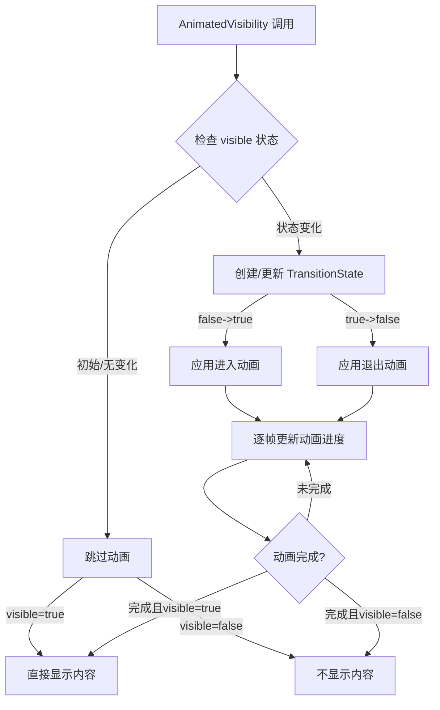

# AnimatedVisibility

## API 基本信息

- **API 名称**：`androidx.compose.animation.AnimatedVisibility`
- **API 类型**：Composable 函数，动画 API
- **所属模块/库**：Compose Animation
- **API 版本**：Compose 1.0.0 起引入，当前最新版本中保持稳定
- **官方文档链接**：[AnimatedVisibility 官方文档](https://developer.android.com/reference/kotlin/androidx/compose/animation/package-summary#AnimatedVisibility(kotlin.Boolean,androidx.compose.ui.Modifier,androidx.compose.animation.EnterTransition,androidx.compose.animation.ExitTransition,kotlin.String,kotlin.Function1))

## API 详细解析

### 函数签名

```kotlin
@Composable
fun AnimatedVisibility(
    visible: Boolean,
    modifier: Modifier = Modifier,
    enter: EnterTransition = fadeIn() + expandIn(),
    exit: ExitTransition = shrinkOut() + fadeOut(),
    label: String = "AnimatedVisibility",
    content: @Composable AnimatedVisibilityScope.() -> Unit
)
```

还有一个重载版本，接受 `MutableTransitionState<Boolean>` 作为 `visibleState` 参数：

```kotlin
@Composable
fun AnimatedVisibility(
    visibleState: MutableTransitionState<Boolean>,
    modifier: Modifier = Modifier,
    enter: EnterTransition = fadeIn() + expandIn(),
    exit: ExitTransition = shrinkOut() + fadeOut(),
    label: String = "AnimatedVisibility",
    content: @Composable AnimatedVisibilityScope.() -> Unit
)
```

### 核心功能

`AnimatedVisibility` 是 Jetpack Compose 中用于创建出现/消失动画的核心 API。它允许开发者基于状态值（`visible`）来控制内容的可见性，并通过指定的进入和退出过渡动画使内容平滑地显示或隐藏。当 `visible` 状态从 `false` 变为 `true` 时触发进入动画，反之则触发退出动画。

该 API 不仅处理可见性的切换，还能同时管理内容的测量、布局和绘制过程，确保动画过程中的视觉效果平滑自然。

### 使用场景

- **条件性 UI 展示**：基于用户交互或应用状态显示/隐藏 UI 元素
- **页面转场**：在不同页面或内容区域之间创建平滑过渡
- **列表项动画**：为列表增删项目添加动画效果
- **错误提示/通知**：动态显示和隐藏提示信息
- **展开/折叠内容**：创建可展开的详情面板或菜单
- **引导式界面**：在新手引导过程中突出显示特定元素

### 参数说明

- **visible/visibleState**：控制内容是否可见的布尔值或状态
  - `visible: Boolean`：简单的布尔值控制可见性
  - `visibleState: MutableTransitionState<Boolean>`：提供更细粒度的控制和状态监听
  
- **modifier**：应用于容器的修饰符，可用于调整布局、添加点击事件等

- **enter**：指定内容出现时的动画效果
  - 默认值为 `fadeIn() + expandIn()`，即淡入 + 扩展
  - 可组合多个动画效果，如 `slideInVertically() + fadeIn()`

- **exit**：指定内容消失时的动画效果
  - 默认值为 `shrinkOut() + fadeOut()`，即收缩 + 淡出
  - 通常与 enter 参数对应，创建一致的视觉体验

- **label**：为动画指定调试标签，在动画检查器中使用
  - 对调试和性能分析有帮助，不影响实际运行效果

- **content**：需要应用动画的内容
  - 在 `AnimatedVisibilityScope` 范围内定义
  - 可以使用 `animateEnterExit` 修饰符为子元素单独配置动画

### 组合规则

- **状态变化**：仅当 `visible` 状态变化时才会触发相应动画
- **初始可见性**：首次组合时，如果 `visible` 为 true，不会播放进入动画，直接显示内容
- **可组合性**：可嵌套在任何容器中，也可嵌套包含其他组件
- **生命周期**：动画完成后，如果 `visible` 为 false，内容将从组合树中移除
- **内存效率**：不可见时，内容不会被布局和绘制，节省资源

### 槽位 API

`AnimatedVisibility` 提供 `AnimatedVisibilityScope` 范围，在该范围内：

- 可以使用 `animateEnterExit` 修饰符为子元素定制独立的动画
- 可以访问动画过程中的进度值
- 内容可以灵活使用任何 Compose UI 元素，没有特定限制

### 源码分析

`AnimatedVisibility` 内部使用 `Transition` API 实现状态转换：

1. 基于 `visible` 状态创建或使用一个 `MutableTransitionState`
2. 使用 `Transition` 管理器处理状态变化和动画
3. 计算并应用进入/退出动画的进度值到内容
4. 通过 `AnimatedVisibilityScope` 提供子元素自定义动画的能力
5. 在动画完成且 `visible` 为 false 时，从组合树中移除内容

### 组件视图

```
┌─────────────────────────────────────────┐
│ AnimatedVisibility Container             │
│  ┌─────────────────────────────────────┐ │
│  │ Content with Enter/Exit Transitions  │ │
│  │                                     │ │
│  │  - fadeIn/fadeOut                   │ │
│  │  - expandIn/shrinkOut               │ │
│  │  - slideIn/slideOut                 │ │
│  │  - scaleIn/scaleOut                 │ │
│  │                                     │ │
│  └─────────────────────────────────────┘ │
└─────────────────────────────────────────┘
```

### 组合流程图



## 代码示例

### 基础用法

简单的可见性切换动画：

```kotlin
@Composable
fun BasicExample() {
    var visible by remember { mutableStateOf(false) }
    
    Column(modifier = Modifier.padding(16.dp)) {
        Button(onClick = { visible = !visible }) {
            Text(if (visible) "隐藏内容" else "显示内容")
        }
        
        Spacer(modifier = Modifier.height(16.dp))
        
        AnimatedVisibility(visible = visible) {
            Card(
                modifier = Modifier.fillMaxWidth(),
                elevation = CardDefaults.cardElevation(defaultElevation = 4.dp)
            ) {
                Text(
                    "这是一段动画显示的内容",
                    modifier = Modifier.padding(16.dp)
                )
            }
        }
    }
}
```

### 进阶用法

自定义进入和退出动画：

```kotlin
@Composable
fun CustomAnimationExample() {
    var visible by remember { mutableStateOf(false) }
    
    Column(modifier = Modifier.padding(16.dp)) {
        Button(onClick = { visible = !visible }) {
            Text(if (visible) "隐藏内容" else "显示内容")
        }
        
        Spacer(modifier = Modifier.height(16.dp))
        
        AnimatedVisibility(
            visible = visible,
            enter = slideInVertically(
                initialOffsetY = { it }, // 从底部滑入
                animationSpec = spring(stiffness = Spring.StiffnessLow)
            ) + fadeIn(),
            exit = slideOutVertically(
                targetOffsetY = { it }, // 滑出到底部
                animationSpec = tween(durationMillis = 300)
            ) + fadeOut()
        ) {
            Card(
                modifier = Modifier.fillMaxWidth(),
                elevation = CardDefaults.cardElevation(defaultElevation = 4.dp)
            ) {
                Text(
                    "自定义动画效果的内容",
                    modifier = Modifier.padding(16.dp)
                )
            }
        }
    }
}
```

### 子元素动画

为嵌套内容单独设置动画：

```kotlin
@Composable
fun ChildAnimationsExample() {
    var visible by remember { mutableStateOf(false) }
    
    Column(modifier = Modifier.padding(16.dp)) {
        Button(onClick = { visible = !visible }) {
            Text(if (visible) "隐藏内容" else "显示内容")
        }
        
        Spacer(modifier = Modifier.height(16.dp))
        
        AnimatedVisibility(
            visible = visible,
            enter = fadeIn(),
            exit = fadeOut()
        ) {
            Column(Modifier.fillMaxWidth()) {
                // 第一个子元素：从左侧滑入
                Text(
                    "第一行内容",
                    modifier = Modifier
                        .padding(8.dp)
                        .animateEnterExit(
                            enter = slideInHorizontally { -it },
                            exit = slideOutHorizontally { -it }
                        )
                )
                
                // 第二个子元素：从右侧滑入，并有延迟
                Text(
                    "第二行内容",
                    modifier = Modifier
                        .padding(8.dp)
                        .animateEnterExit(
                            enter = slideInHorizontally(
                                initialOffsetX = { it },
                                animationSpec = tween(delayMillis = 100)
                            ),
                            exit = slideOutHorizontally { it }
                        )
                )
            }
        }
    }
}
```

### 与状态管理结合

使用 `MutableTransitionState` 监控动画状态：

```kotlin
@Composable
fun TransitionStateExample() {
    val transitionState = remember {
        MutableTransitionState(false).apply {
            // 启动时立即开始进入动画
            targetState = true
        }
    }
    
    // 监听动画状态
    if (transitionState.isIdle && transitionState.currentState) {
        // 动画完成且内容已显示，可执行额外逻辑
        LaunchedEffect(Unit) {
            Log.d("AnimatedVisibility", "内容显示动画已完成")
        }
    }
    
    Column(modifier = Modifier.padding(16.dp)) {
        Button(onClick = { 
            transitionState.targetState = !transitionState.targetState
        }) {
            Text(
                if (transitionState.targetState) "隐藏内容" else "显示内容"
            )
        }
        
        Spacer(modifier = Modifier.height(16.dp))
        
        AnimatedVisibility(
            visibleState = transitionState,
            enter = fadeIn() + expandVertically(),
            exit = fadeOut() + shrinkVertically()
        ) {
            Card(
                modifier = Modifier.fillMaxWidth(),
                elevation = CardDefaults.cardElevation(defaultElevation = 4.dp)
            ) {
                Text(
                    "使用 TransitionState 管理的内容",
                    modifier = Modifier.padding(16.dp)
                )
            }
        }
    }
}
```

### 最佳实践

实现一个返回顶部按钮：

```kotlin
@Composable
fun ScrollToTopButton() {
    val listState = rememberLazyListState()
    val scope = rememberCoroutineScope()
    
    // 使用 derivedStateOf 计算是否显示按钮
    val showButton by remember {
        derivedStateOf {
            listState.firstVisibleItemIndex > 0 ||
            listState.firstVisibleItemScrollOffset > 0
        }
    }
    
    Box(Modifier.fillMaxSize()) {
        LazyColumn(state = listState) {
            items(100) { index ->
                ListItem(
                    headlineContent = { Text("项目 $index") },
                    supportingContent = { Text("详细信息") }
                )
                Divider()
            }
        }
        
        AnimatedVisibility(
            visible = showButton,
            modifier = Modifier
                .align(Alignment.BottomEnd)
                .padding(16.dp),
            enter = fadeIn() + scaleIn(),
            exit = fadeOut() + scaleOut()
        ) {
            FloatingActionButton(
                onClick = {
                    scope.launch {
                        listState.animateScrollToItem(0)
                    }
                }
            ) {
                Icon(
                    Icons.Default.ArrowUpward,
                    contentDescription = "返回顶部"
                )
            }
        }
    }
}
```

### 常见错误

1. **不必要的频繁状态更新**：

```kotlin
// 错误示例：更新频率过高导致动画重启
@Composable
fun ProblematicExample() {
    val randomValue = remember { mutableStateOf(0) }
    
    // 每次重组都会生成新的随机值，导致动画频繁重启
    LaunchedEffect(Unit) {
        while (true) {
            delay(100)
            randomValue.value = Random.nextInt()
        }
    }
    
    AnimatedVisibility(
        visible = randomValue.value % 2 == 0 // 错误：频繁切换可见性
    ) {
        Text("内容会频繁闪烁")
    }
}

// 正确示例：适当控制状态更新频率
@Composable
fun CorrectExample() {
    var showContent by remember { mutableStateOf(false) }
    
    Button(onClick = { showContent = !showContent }) {
        Text("切换显示状态")
    }
    
    AnimatedVisibility(visible = showContent) {
        Text("平滑动画的内容")
    }
}
```

2. **动画时间过短或过长**：

```kotlin
// 错误示例：动画时间设置不当
AnimatedVisibility(
    visible = visible,
    enter = fadeIn(animationSpec = tween(10)), // 错误：时间过短，几乎看不到动画
    exit = fadeOut(animationSpec = tween(5000)) // 错误：时间过长，用户体验差
) {
    Content()
}

// 正确示例：合适的动画时长
AnimatedVisibility(
    visible = visible,
    enter = fadeIn(animationSpec = tween(300)), // 适当的时长
    exit = fadeOut(animationSpec = tween(200)) // 退出可以稍快
) {
    Content()
}
```

## 性能与优化

### 重组优化

- **状态管理**：`AnimatedVisibility` 内部使用 `remember` 记忆动画状态，避免重组时重置动画
- **条件渲染**：当内容不可见且动画完成后，内容不会被测量、布局和绘制，有效减少不必要的计算
- **资源回收**：内容完全不可见时会从组合树中移除，释放资源

### 稳定性影响

- 确保传入的 `visible` 参数具有稳定性，避免不必要的重组和动画重启
- 使用 `remember { derivedStateOf { ... } }` 来避免中间状态触发不必要的动画
- 使用 `key` 参数可以在内容变化时强制执行新的动画序列

### 记忆化策略

对于复杂动画或状态逻辑，应使用适当的记忆化策略：

```kotlin
@Composable
fun OptimizedAnimatedContent() {
    // 记忆化状态值
    var visible by remember { mutableStateOf(false) }
    
    // 记忆化动画规格，避免每次重组创建新实例
    val enterTransition = remember {
        fadeIn(animationSpec = tween(300)) + 
        expandVertically(animationSpec = spring())
    }
    
    val exitTransition = remember {
        fadeOut(animationSpec = tween(200)) + 
        shrinkVertically(animationSpec = spring())
    }
    
    Button(onClick = { visible = !visible }) {
        Text("切换")
    }
    
    AnimatedVisibility(
        visible = visible,
        enter = enterTransition,
        exit = exitTransition
    ) {
        // 内容
    }
}
```

### 延迟加载

可以使用 `AnimatedVisibility` 实现内容的延迟加载：

```kotlin
@Composable
fun LazyLoadingExample() {
    var loadContent by remember { mutableStateOf(false) }
    
    LaunchedEffect(Unit) {
        delay(500) // 延迟加载
        loadContent = true
    }
    
    Box(Modifier.fillMaxSize()) {
        AnimatedVisibility(
            visible = loadContent,
            enter = fadeIn(tween(800)) + expandIn(tween(800)),
            modifier = Modifier.align(Alignment.Center)
        ) {
            // 重量级内容
            HeavyContent()
        }
        
        // 加载状态指示器
        if (!loadContent) {
            CircularProgressIndicator(Modifier.align(Alignment.Center))
        }
    }
}
```

## 组合上下文和副作用

### 组合上下文

`AnimatedVisibility` 创建一个特殊的组合上下文 `AnimatedVisibilityScope`，在此上下文中：

- 可以访问动画相关属性和方法
- 可以对子元素使用 `animateEnterExit` 修饰符
- 可以访问 `transition` 对象，了解动画的具体状态

### 副作用管理

处理动画相关的副作用：

```kotlin
@Composable
fun SideEffectExample() {
    var visible by remember { mutableStateOf(false) }
    val transitionState = remember { MutableTransitionState(false) }
    
    // 同步外部状态到 transitionState
    LaunchedEffect(visible) {
        transitionState.targetState = visible
    }
    
    // 监听动画完成事件
    LaunchedEffect(transitionState.currentState) {
        if (transitionState.isIdle) {
            if (transitionState.currentState) {
                Log.d("Animation", "进入动画完成")
                // 可以触发其他操作，如播放声音、触发事件等
            } else {
                Log.d("Animation", "退出动画完成")
            }
        }
    }
    
    Button(onClick = { visible = !visible }) {
        Text("切换")
    }
    
    AnimatedVisibility(visibleState = transitionState) {
        Card { 
            Text("内容", Modifier.padding(16.dp)) 
        }
    }
}
```

### 生命周期关联

`AnimatedVisibility` 与组件生命周期的关联：

- 组件进入组合树时，如果 `visible` 为 true，则显示内容（初始无动画）
- 状态变化时触发相应动画
- 退出动画完成后，内容从组合树中移除，相关资源被释放
- 可以使用 `DisposableEffect` 在内容移除时执行清理操作

```kotlin
@Composable
fun LifecycleExample() {
    var visible by remember { mutableStateOf(false) }
    
    Button(onClick = { visible = !visible }) {
        Text(if (visible) "隐藏" else "显示")
    }
    
    AnimatedVisibility(visible = visible) {
        DisposableEffect(Unit) {
            // 内容进入组合树时执行
            Log.d("Lifecycle", "内容已添加到组合树")
            
            onDispose {
                // 内容从组合树移除时执行
                Log.d("Lifecycle", "内容已从组合树移除")
            }
        }
        
        Text("带生命周期跟踪的内容")
    }
}
```

## 版本兼容性

### API 变化

- **Compose 1.0.0**：最初引入 `AnimatedVisibility` API
- **Compose 1.1.0**：添加了 `AnimatedVisibilityScope.animateEnterExit` 扩展，增强子元素动画控制能力
- **Compose 1.2.0**：改进了动画性能和组合优化
- **Compose 1.4.0**：优化了 `MutableTransitionState` 使用体验

### 替代和补充 API

- **Crossfade**：在两个内容之间平滑过渡，适用于内容替换场景
- **AnimatedContent**：更复杂的内容过渡，支持不同状态间的自定义动画
- **animateContentSize**：仅动画化尺寸变化，适用于内容展开/收起
- **Transition**：底层 API，提供更灵活的状态转换动画

## 相关 API

### 协作 API

- **EnterTransition/ExitTransition**：定义进入和退出动画
- **fadeIn/fadeOut**：淡入淡出效果
- **slideIn/slideOut**：滑动效果
- **expandIn/shrinkOut**：扩大/缩小效果
- **scaleIn/scaleOut**：缩放效果
- **AnimatedVisibilityScope**：扩展内容作用域的功能
- **MutableTransitionState**：管理和监控转换状态

### 替代方案

与其他动画 API 的比较：

| API | 使用场景 | 优点 | 不足 |
|-----|---------|------|------|
| AnimatedVisibility | 内容显示/隐藏 | 简单易用，内置多种过渡效果 | 仅适用于显示/隐藏场景 |
| Crossfade | 内容替换 | 平滑过渡不同内容 | 仅支持淡入淡出效果 |
| AnimatedContent | 状态转换动画 | 最强大灵活，支持复杂转换 | 学习曲线较陡 |
| animateContentSize | 尺寸变化 | 轻量级，易于使用 | 仅动画化尺寸变化 |

## 与 Compose 架构的关系

### 声明式 UI

`AnimatedVisibility` 完美契合 Compose 的声明式设计理念：

- 通过 `visible` 参数声明性地控制内容可见性
- 动画状态自动管理，无需命令式代码
- 动画配置以声明式方式定义

### 单向数据流

符合 Compose 的单向数据流模式：

1. 上游状态变化（如 `visible` 状态改变）
2. 触发重组和动画状态更新
3. 根据动画状态渲染 UI，不影响上游数据

### 组合理念

体现了 Compose 的组合复用理念：

- 可以组合不同的进入/退出动画
- 可以嵌套在其他容器内
- 可以与其他 Composable 函数自由组合
- 提供 `AnimatedVisibilityScope` 使内容可以访问动画状态

### 分层架构

在 Compose 分层架构中的位置：

- 建立在 Compose Runtime 和 Animation Core 之上
- 提供比底层 `Transition` API 更高级的抽象
- 为 UI 层提供易用的动画功能
- 通过提供多种动画效果和组合方式，从而实现高度可定制性

```mermaid
flowchart TD
    A[Compose Runtime] --> B[Animation Core]
    B --> C[Transition API]
    C --> D[AnimatedVisibility]
    D --> E[应用 UI 层]
    
    F[EnterTransition/ExitTransition] --> D
    G[TransitionState] --> D
</rewritten_file>
