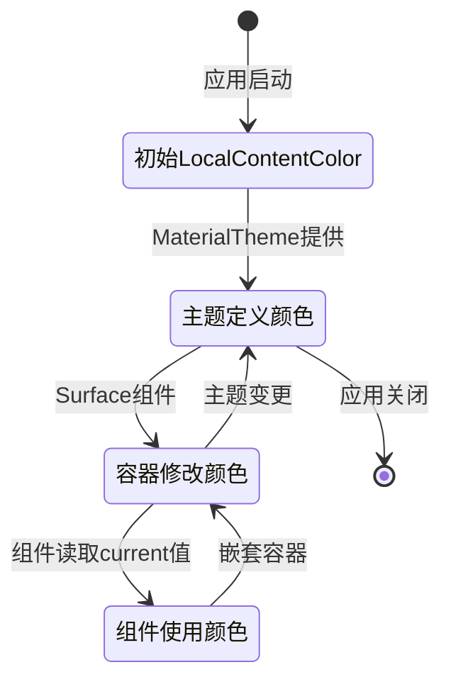

# LocalContentColor.current

## API 基本信息

- **API 名称**：`androidx.compose.material3.LocalContentColor.current`
- **API 类型**：状态相关 API，CompositionLocal API
- **所属模块/库**：Compose Material3
- **API 版本**：Compose 1.0.0 起引入，当前最新版本中保持稳定
- **官方文档链接**：[LocalContentColor 官方文档](https://developer.android.com/reference/kotlin/androidx/compose/material3/package-summary#LocalContentColor)

## API 详细解析

### 设计目的

`LocalContentColor.current` 是 Jetpack Compose 中的一个重要 API，设计用于提供与当前主题一致的、上下文相关的内容颜色。它通过 CompositionLocal 机制实现，能够在不同的组合层次中提供默认内容颜色，简化组件开发，并确保颜色风格在整个 UI 层次结构中保持一致性。

### 状态行为

- **生命周期**：作为 CompositionLocal 值，其生命周期与 Composition 相关联
- **变化机制**：当上层提供者（Provider）更新 LocalContentColor 值时，会触发使用者的重组
- **作用范围**：从提供 LocalContentColor 值的组件开始，到下一个提供新值的组件为止，形成一个层级区域

### 状态类型

`LocalContentColor.current` 属于共享状态类型，它是一个通过 Composition 传递的上下文值，而非组件私有状态。

### 重组行为

当 LocalContentColor 的值变化时，所有读取 `LocalContentColor.current` 的组件都会触发重组。但由于 Color 是一个不可变类型，它的状态变化通常只发生在主题切换或容器背景色变化时，不会频繁触发重组。

### 使用场景

- 在自定义组件中正确响应主题颜色变化
- 在不同背景颜色的容器中调整内容颜色
- 确保图标、文本等元素的颜色与其容器背景色形成适当对比
- 创建遵循 Material Design 规范的一致性 UI

### 状态流转图



## 代码示例

### 基础用法

```kotlin
@Composable
fun SimpleText() {
    // 使用当前上下文的内容颜色
    Text(
        text = "这段文字会使用当前内容颜色",
        color = LocalContentColor.current
    )
}
```

### 进阶用法

```kotlin
@Composable
fun CustomContainer(
    content: @Composable () -> Unit
) {
    Surface(
        color = MaterialTheme.colorScheme.primary
    ) {
        // 为内容提供新的上下文颜色
        CompositionLocalProvider(
            LocalContentColor provides MaterialTheme.colorScheme.onPrimary
        ) {
            content()
        }
    }
}
```

### 与状态管理结合

```kotlin
@Composable
fun ThemeAwareButton(
    onClick: () -> Unit,
    content: @Composable () -> Unit
) {
    val buttonColor = MaterialTheme.colorScheme.primary
    val contentColor = MaterialTheme.colorScheme.onPrimary
    
    Button(
        onClick = onClick,
        colors = ButtonDefaults.buttonColors(
            containerColor = buttonColor,
            contentColor = contentColor
        )
    ) {
        // 按钮内容会继承按钮的 contentColor
        // 但可以在这里使用 LocalContentColor.current 读取
        CompositionLocalProvider(
            LocalContentColor provides LocalContentColor.current.copy(alpha = 0.8f)
        ) {
            content()
        }
    }
}
```

### 最佳实践

```kotlin
@Composable
fun CustomIconButton(
    onClick: () -> Unit,
    icon: @Composable () -> Unit,
    enabled: Boolean = true,
    modifier: Modifier = Modifier
) {
    Box(
        modifier = modifier
            .clickable(enabled = enabled, onClick = onClick)
            .padding(12.dp),
        contentAlignment = Alignment.Center
    ) {
        // 根据启用状态调整透明度
        val contentAlpha = if (enabled) 1f else 0.5f
        CompositionLocalProvider(
            LocalContentColor provides LocalContentColor.current.copy(alpha = contentAlpha)
        ) {
            icon()
        }
    }
}
```

### 常见错误

```kotlin
// 错误：忽略主题定义的内容颜色
@Composable
fun IncorrectText() {
    // 硬编码颜色，不会随主题变化
    Text("固定颜色文本", color = Color.Black)
}

// 正确：尊重主题颜色系统
@Composable
fun CorrectText() {
    // 使用 LocalContentColor，随主题变化
    Text("适配主题的文本", color = LocalContentColor.current)
}
```

## 性能与优化

### 重组优化

由于 `LocalContentColor.current` 仅在上层提供的值变化时才会触发重组，因此通常不会成为性能瓶颈。但应避免在每次重组中创建新的 Color 实例作为 LocalContentColor 的值。

### 稳定性影响

Color 是一个稳定的不可变类型，这意味着它的引用相等性与结构相等性一致。因此，LocalContentColor 的变化只会在实际颜色值变化时触发重组。

### 记忆化策略

对于需要基于 LocalContentColor 计算的派生颜色，应考虑使用 `remember` 进行记忆化：

```kotlin
@Composable
fun OptimizedColorUsage() {
    val baseColor = LocalContentColor.current
    // 记忆化派生颜色计算
    val derivedColor = remember(baseColor) {
        // 复杂的颜色计算
        baseColor.copy(alpha = 0.75f)
    }
    
    Icon(
        imageVector = Icons.Default.Favorite,
        contentDescription = null,
        tint = derivedColor
    )
}
```

## 组合上下文和副作用

### 组合上下文

`LocalContentColor.current` 是通过 CompositionLocal 系统实现的上下文传递机制的典型应用。它允许颜色信息在组合树中从父级向子级传递，而无需通过显式参数。

### 上下文收集

Material 组件如 Surface、Button 等会通过 CompositionLocalProvider 提供适当的 LocalContentColor 值，子组件可以通过 `LocalContentColor.current` 读取这些值：

```kotlin
@Composable
fun ContentAwareContainer() {
    Surface(color = MaterialTheme.colorScheme.primary) {
        // 此处 Surface 已提供了适合 primary 背景的 LocalContentColor
        Text("文本颜色会自动适配背景") // 文本使用 onPrimary 颜色
        
        // 嵌套容器可以提供新的内容颜色
        Surface(color = MaterialTheme.colorScheme.secondary) {
            // 此处文本会使用 onSecondary 颜色
            Text("嵌套容器中的文本颜色也会适配")
        }
    }
}
```

## 相关 API

### 协作 API

- **LocalContentAlpha**：控制内容的透明度（已在 Material3 中弃用，建议直接使用颜色的 alpha）
- **MaterialTheme.colorScheme**：提供主题定义的色彩方案
- **contentColorFor**：根据背景色自动确定适合的内容颜色
- **CompositionLocalProvider**：提供新的 CompositionLocal 值

### 替代方案

对于需要更灵活的颜色管理，可以考虑：

- 直接使用 MaterialTheme.colorScheme 中的颜色
- 创建自定义的 CompositionLocal 颜色系统
- 使用状态提升和参数传递显式管理颜色

## 与 Compose 架构的关系

### 声明式 UI

`LocalContentColor.current` 符合 Compose 的声明式设计理念，它允许组件根据上下文自适应其内容颜色，而不需要命令式地设置和更新颜色值。

### 组合理念

该 API 展示了 Compose 的组合理念，通过 CompositionLocal 系统实现了颜色信息在不同组合层次间的隐式传递，简化了 API 设计，同时保持了功能的强大和灵活。

### 分层架构

`LocalContentColor.current` 位于 Compose Material 层，它是连接 Foundation 层核心组件与 Material Design 规范的桥梁，确保 UI 组件能够正确响应主题变化，并保持视觉一致性。
