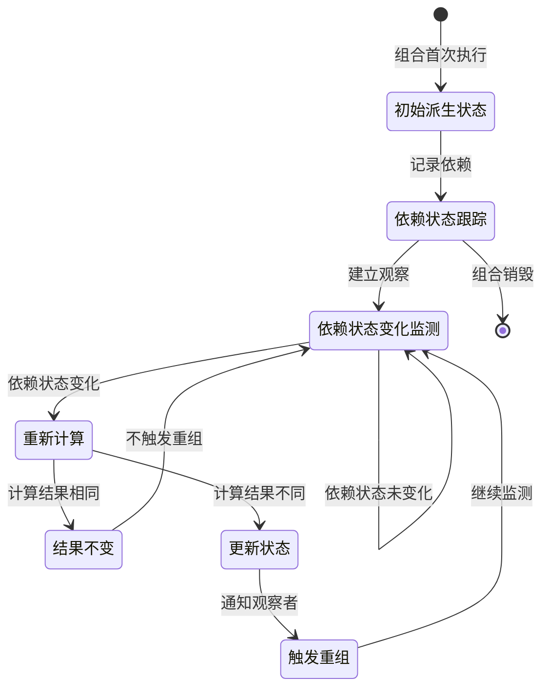
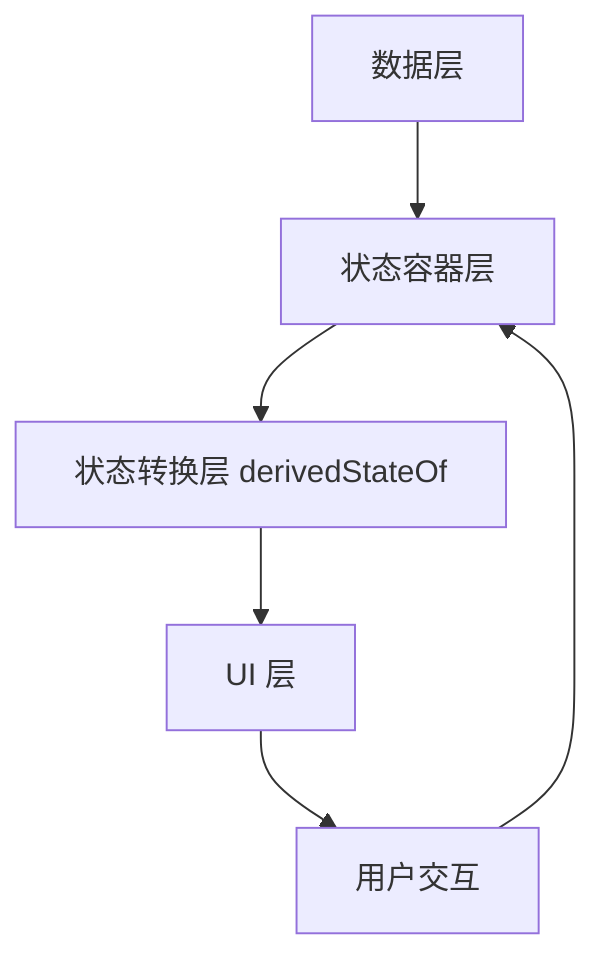

# derivedStateOf API 详解

## API 基本信息

- **API 名称**：androidx.compose.runtime.derivedStateOf
- **API 类型**：状态相关 API
- **所属模块/库**：Compose Runtime
- **API 版本**：Compose 1.0.0-alpha01 首次引入，当前最新版本支持
- **官方文档链接**：[derivedStateOf 官方文档](https://developer.android.com/reference/kotlin/androidx/compose/runtime/package-summary#derivedStateOf(kotlin.Function0))

## API 详细解析

### 设计目的

`derivedStateOf` 的设计目的是创建一个依赖于其他状态的派生状态，它只在依赖的状态发生变化且计算结果不同时才触发重组。这种机制有效减少了不必要的重组操作，提高了应用性能，特别是在复杂的 UI 计算场景中。

### 状态行为

- **生命周期**：派生状态的生命周期与创建它的组合作用域绑定。当组合离开作用域时，派生状态也会被销毁。
- **变化机制**：派生状态会跟踪其计算过程中读取的所有状态对象。只有当这些依赖状态变化且导致计算结果不同时，派生状态才会通知观察者（通常是 UI 组件）进行更新。
- **作用范围**：派生状态通常在 `@Composable` 函数内部创建，并且其作用范围限定在创建它的组合及其子组合内。

### 状态类型

`derivedStateOf` 适用于以下状态类型：

- **派生状态**：从一个或多个现有状态计算得出的新状态
- **转换状态**：对原始状态进行转换或格式化的状态
- **聚合状态**：将多个状态合并或聚合为单个值的状态
- **条件状态**：基于条件逻辑从其他状态派生的布尔值状态

### 重组行为

`derivedStateOf` 使用了 Compose 的智能重组系统来优化性能：

1. **选择性重组**：只有当依赖状态变化且导致计算结果不同时，才会触发重组
2. **延迟计算**：计算过程推迟到状态实际被读取时执行，而不是在声明时
3. **重组隔离**：使用派生状态可以将重组限制在更小的范围内，避免整个组件树重组

### 使用场景

`derivedStateOf` 适合以下场景：

1. **列表过滤与排序**：基于原始列表状态创建过滤或排序后的列表视图
2. **复杂条件计算**：当需要基于多个状态计算一个条件值时（如表单验证）
3. **UI 状态转换**：将数据状态转换为特定的 UI 展示状态（如格式化文本）
4. **滚动状态派生**：根据滚动位置计算是否显示返回顶部按钮
5. **多状态组合**：将多个独立状态组合成单一状态以简化 UI 逻辑

### 状态流转图



## 代码示例

### 基础用法

简单的派生状态示例，根据滚动位置确定 FAB 是显示扩展还是折叠状态：

```kotlin
val scrollState = rememberScrollState()

// 使用 derivedStateOf 创建派生状态
val fabExtended by remember { derivedStateOf { scrollState.value == 0 } }

// 在 UI 中使用派生状态
ProfileFab(
    extended = fabExtended,
    userIsMe = userData.isMe(),
    modifier = Modifier.align(Alignment.BottomEnd)
)
```

### 进阶用法

使用 `derivedStateOf` 处理列表过滤和复杂条件判断：

```kotlin
// 原始列表状态
val allItems by remember { mutableStateOf(initialItems) }
val searchQuery by remember { mutableStateOf("") }

// 派生的过滤列表状态
val filteredItems by remember {
    derivedStateOf {
        if (searchQuery.isEmpty()) {
            allItems
        } else {
            allItems.filter { it.title.contains(searchQuery, ignoreCase = true) }
        }
    }
}

// 在 LazyColumn 中使用过滤后的列表
LazyColumn {
    items(filteredItems) { item ->
        ItemRow(item)
    }
}
```

### 与状态管理结合

结合 ViewModel 和 `collectAsState` 使用派生状态：

```kotlin
@Composable
fun UserListScreen(viewModel: UserViewModel) {
    val users by viewModel.users.collectAsState()
    val searchQuery by viewModel.searchQuery.collectAsState()
    
    // 使用 derivedStateOf 处理过滤逻辑
    val filteredUsers by remember {
        derivedStateOf {
            val query = searchQuery.trim()
            if (query.isEmpty()) {
                users
            } else {
                users.filter { 
                    it.name.contains(query, ignoreCase = true) ||
                    it.email.contains(query, ignoreCase = true)
                }
            }
        }
    }
    
    // 显示过滤后的用户列表
    UserList(users = filteredUsers)
}
```

### 最佳实践

处理滚动状态以显示或隐藏"返回顶部"按钮：

```kotlin
@Composable
fun LongList() {
    val listState = rememberLazyListState()
    val scope = rememberCoroutineScope()
    
    // 计算是否应该显示"返回顶部"按钮
    val showButton by remember {
        derivedStateOf {
            listState.firstVisibleItemIndex > 0 || listState.firstVisibleItemScrollOffset > 0
        }
    }
    
    Box {
        LazyColumn(state = listState) {
            // 列表内容
            items(1000) { index ->
                Text("Item #$index", modifier = Modifier.padding(16.dp))
            }
        }
        
        // 使用派生状态控制按钮可见性
        AnimatedVisibility(
            visible = showButton,
            modifier = Modifier.align(Alignment.BottomCenter),
            enter = fadeIn() + slideInVertically(),
            exit = fadeOut() + slideOutVertically()
        ) {
            FloatingActionButton(
                onClick = {
                    scope.launch {
                        listState.animateScrollToItem(0)
                    }
                }
            ) {
                Icon(Icons.Default.ArrowUpward, contentDescription = "返回顶部")
            }
        }
    }
}
```

### 常见错误

1. **在派生状态计算中修改状态**：

```kotlin
// 错误示例
val derivedState by remember {
    derivedStateOf {
        // 不应在计算过程中修改其他状态
        someOtherState.value = computedValue // 错误！
        computeSomething(someState.value)
    }
}

// 正确示例
val derivedState by remember {
    derivedStateOf {
        // 只计算并返回结果，不修改其他状态
        computeSomething(someState.value)
    }
}
```

2. **不必要的 `derivedStateOf` 使用**：

```kotlin
// 不必要的使用 - 不涉及状态计算
val message by remember {
    derivedStateOf {
        "静态文本"  // 错误！不依赖任何状态
    }
}

// 简单转换也不需要 derivedStateOf
val userGreeting by remember {
    derivedStateOf {
        "您好，${userName.value}" // 可以但没必要
    }
}

// 正确用法 - 直接在组合中使用简单转换
Text(text = "您好，$userName")
```

## 性能与优化

### 重组优化

`derivedStateOf` 通过以下机制优化重组性能：

1. **依赖追踪**：自动追踪计算过程中读取的所有状态对象
2. **相等性检查**：比较新旧计算结果，只有不同时才触发重组
3. **智能调度**：与 Compose 的重组调度系统集成，在合适的时机触发重组

### 稳定性影响

- **参数稳定性**：传递给 `derivedStateOf` 的计算函数应避免捕获不稳定的引用
- **结果稳定性**：计算结果应使用实现了正确 `equals()` 方法的类型，以便进行有效的相等性比较

### 记忆化策略

推荐的记忆化策略：

```kotlin
// 基本用法
val derivedState by remember { derivedStateOf { /* 计算 */ } }

// 带键的记忆化 - 当键变化时重新创建派生状态
val derivedState by remember(key1, key2) { derivedStateOf { /* 计算 */ } }

// 避免不必要的 remember 嵌套
// 不推荐
val rememberedState = remember { someState } // 不必要的嵌套
val derivedValue by remember { derivedStateOf { compute(rememberedState.value) } }

// 推荐
val derivedValue by remember { derivedStateOf { compute(someState.value) } }
```

### 最佳实践

1. **使用 `derivedStateOf` 处理复杂计算**：特别是当计算涉及多个状态或集合处理时
2. **避免在 `derivedStateOf` 内部触发副作用**：计算函数应是纯函数
3. **保持计算逻辑简单**：过于复杂的逻辑可能导致性能问题
4. **使用 `remember` 缓存 `derivedStateOf` 实例**：避免在每次重组时重新创建

## 组合上下文和副作用

### 组合上下文

- `derivedStateOf` 必须在组合上下文中创建，通常在 `@Composable` 函数内
- 派生状态会在当前组合节点中建立与依赖状态的关联

### 副作用管理

- `derivedStateOf` 本身不应包含副作用，它应只用于计算值
- 对于需要基于派生状态执行的副作用，应使用 `LaunchedEffect` 或其他副作用 API

```kotlin
val isAtTop by remember { derivedStateOf { scrollState.value == 0 } }

// 基于派生状态触发副作用
LaunchedEffect(isAtTop) {
    if (isAtTop) {
        analytics.logEvent("user_scrolled_to_top")
    }
}
```

### 状态提升

在状态提升模式中，`derivedStateOf` 通常用于局部 UI 状态推导，而不是提升的状态：

```kotlin
// 提升的主要状态
val (items, setItems) = remember { mutableStateOf(listOf<Item>()) }
val (filter, setFilter) = remember { mutableStateOf("") }

// 局部派生状态 - 不需要提升
val filteredItems by remember {
    derivedStateOf {
        items.filter { it.name.contains(filter, ignoreCase = true) }
    }
}
```

### 重组范围

`derivedStateOf` 可以帮助限制重组范围，尤其是将复杂条件封装为单个状态时：

```kotlin
@Composable
fun ComplexScreen(viewModel: ScreenViewModel) {
    // 多个状态
    val isLoading by viewModel.isLoading.collectAsState()
    val hasError by viewModel.error.collectAsState()
    val data by viewModel.data.collectAsState()
    val isUserLoggedIn by viewModel.isUserLoggedIn.collectAsState()
    
    // 派生的屏幕状态 - 避免在多个地方重复计算
    val screenState by remember {
        derivedStateOf {
            when {
                isLoading -> ScreenState.Loading
                hasError -> ScreenState.Error
                !isUserLoggedIn -> ScreenState.NeedsLogin
                data.isEmpty() -> ScreenState.Empty
                else -> ScreenState.Content
            }
        }
    }
    
    // 基于单一派生状态渲染UI
    when (screenState) {
        ScreenState.Loading -> LoadingIndicator()
        ScreenState.Error -> ErrorMessage()
        ScreenState.NeedsLogin -> LoginPrompt()
        ScreenState.Empty -> EmptyState()
        ScreenState.Content -> DataContent(data)
    }
}
```

## 版本兼容性

### API 变化

- 从 Compose 1.0.0-alpha01 起引入，基本功能保持稳定
- 性能优化和内部实现在后续版本中有所改进，但公共 API 保持一致

### 实验性 API

`derivedStateOf` 自 Compose 1.0 正式版发布后已经是稳定 API，可以安全使用。

## 相关 API

### 协作 API

- **`remember`**：与 `derivedStateOf` 配合使用，缓存派生状态实例
- **`mutableStateOf`**：创建可变状态，常作为 `derivedStateOf` 的依赖源
- **`collectAsState`**：将 Flow 转换为 Compose 状态，可以与 `derivedStateOf` 组合使用
- **`rememberUpdatedState`**：捕获最新值的引用，处理某些边缘情况下的状态更新

### 替代方案

- **直接在组合中计算**：对于简单计算，可以直接在 UI 层执行而不使用 `derivedStateOf`
- **`produceState`**：适用于需要从挂起函数或异步源创建状态的场景
- **`snapshotFlow`**：将 Compose 状态转换为 Flow，用于在非组合环境中观察状态

## 与 Compose 架构的关系

### 声明式 UI

`derivedStateOf` 完美契合声明式 UI 的理念：UI 是状态的函数。派生状态允许我们将复杂的状态计算逻辑从 UI 描述中分离出来，保持 UI 代码的清晰和声明性。

### 单向数据流

在单向数据流模式中，`derivedStateOf` 作为转换层，将原始状态转换为 UI 友好的形式，而不改变数据流向：

```
[数据源] -> [状态容器] -> [derivedStateOf] -> [UI组件]
```

### 状态下沉

`derivedStateOf` 支持状态下沉模式，可以在保持状态提升的同时处理复杂的局部状态计算：

```kotlin
// 提升的主要状态
val (searchText, setSearchText) = remember { mutableStateOf("") }

// 组件内部的派生状态 - 不需要提升
@Composable
fun SearchResults(items: List<Item>, searchText: String) {
    // 局部派生状态
    val filteredItems by remember(items, searchText) {
        derivedStateOf {
            if (searchText.isEmpty()) {
                items
            } else {
                items.filter { it.matches(searchText) }
            }
        }
    }
    
    // 使用派生状态渲染 UI
    LazyColumn {
        items(filteredItems) { item ->
            ItemRow(item)
        }
    }
}
```

### 组合理念

`derivedStateOf` 体现了 Compose 的组合理念，它允许我们从基础状态组合出更复杂的派生状态，同时保持状态变化的响应性和性能优化。

### 分层架构

在 Compose 的分层架构中，`derivedStateOf` 位于状态管理层与 UI 层之间，充当数据转换的中间层：



这种分层促进了关注点分离，使状态处理逻辑与 UI 渲染逻辑解耦，提高了代码的可维护性和可测试性。
